<!--
headingDivider: 1
-->

# _Rendering 変遷_

_永田 佑斗_

# 導入

# なぜ、この話題なのか。

- 2023 年 5 月 5 日、Next.js13.4 では、AppRouter が Stable になった。AppRouter によってレンダリング手法は転換期を迎えている。

- いままでのレンダリング手法をまとめ、最新のレンダリング技術のすばらしさを実感してもらおう。

- 利用率１位のフロントエンドライブラリの**React**

- 利用率１位のレンダリングフレームワーク**Next.js**

[参考資料](https://www.publickey1.jp/blog/23/state_of_javascript_20221reactnextjsjest4.html)

# 参考文献

Zenn:[一言で理解する React Server Components](https://zenn.dev/uhyo/articles/react-server-components-multi-stage)

Zenn:[React Server Components を理解したい](https://zenn.dev/yuu104/articles/react-server-component)

Zenn:[SSR, CSR, SSG, PPR の整理](https://zenn.dev/beingish/articles/a5545ebf4f1fa7)

Zenn:[PPR - pre-rendering 新時代の到来と SSR/SSG 論争の終焉](https://zenn.dev/akfm/articles/nextjs-partial-pre-rendering)

Zenn:[SPA/MPA と CSR/SSR/SSG の分類](https://zenn.dev/mt877/articles/6dc3afe99ee794)

Udemy:[Next.js 13 App Router による次世代 Web 開発](https://defidejp.udemy.com/course/nextjs-supabase-app-directory/learn/lecture/37760856#overview)

# 用語

サーバーサイドレンダリングの"レンダリング"の意味は、
[React Docs](https://react.dev/learn/render-and-commit#step-2-react-renders-your-components)

> “Rendering” is React calling your components.

React がコンポーネントを呼び出し、
DOM に反映させるための情報を読み込むことを指す。

≠ ブラウザレンダリング（DOM を作成し、画面に描画すること）

[ブラウザレンダリングの仕組み](https://zenn.dev/ak/articles/c28fa3a9ba7edb)

#

ブラウザレンダリングの指すレンダリング

#


#

サーバーサイドレンダリングの指すレンダリング
[ReactDocument](https://ja.react.dev/learn/render-and-commit)

> エピローグ：ブラウザのペイント
> レンダーが完了し、React が DOM を更新した後、ブラウザは画面を再描画します。このプロセスは「ブラウザレンダリング」として知られていますが、我々は、混乱を避けるために、ドキュメント全体を通して「ペイント」と呼ぶことにします。

#

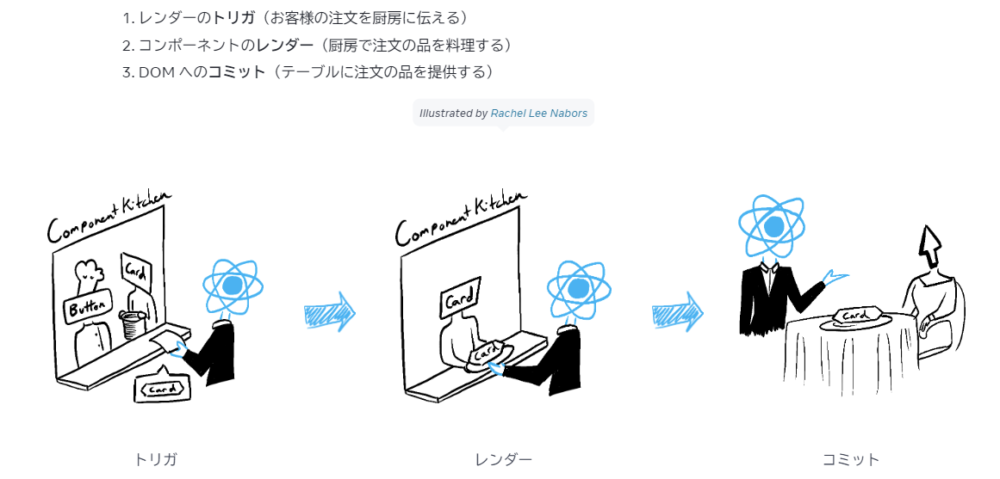

# 用語

Single Page Application ↔︎ Multi Page Application
SPA・MPA ともにアプリケーションの種別
※CSR・SSR・SSG などはレンダリングの技術

- SPA:1 つの HTML ファイルで画面遷移を完結させ、動的に URL や画面内の要素を書き換えるアプリケーション
- MPA:各画面遷移ごとにファイルを要求するアプリケーション

[SPA と対になるのは MPA で、SSR と対になるのは CSR なんだよという話](https://zenn.dev/shunshimono/articles/2023-04-02_ssr-csr-mpa-spa)

#

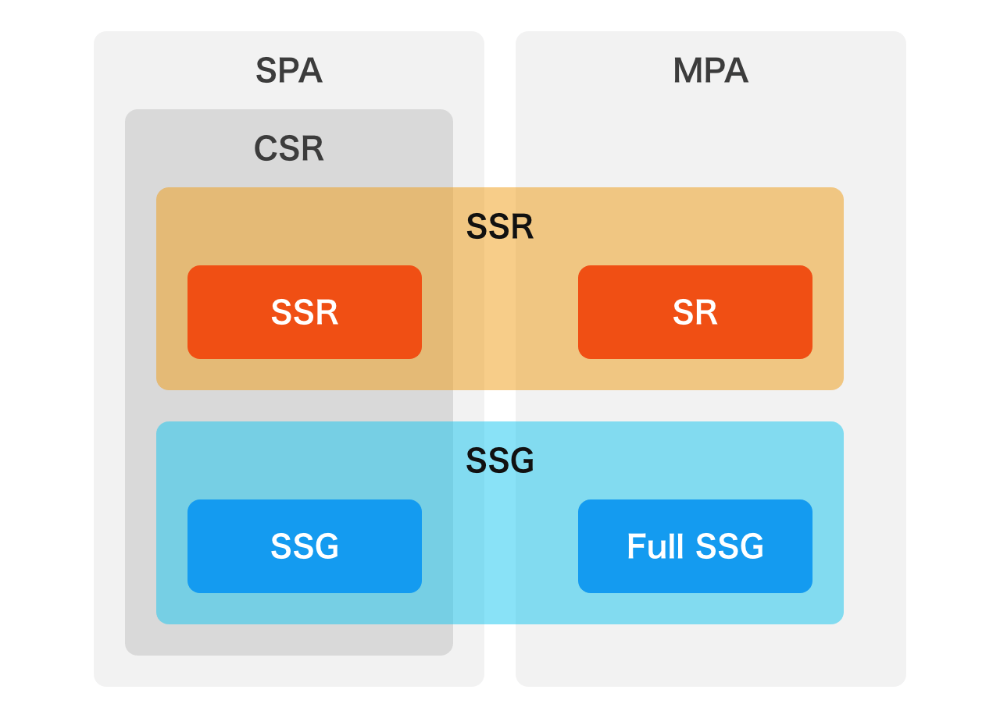

# 用語

- React
  JavaScript 言語を用いた、Web サイト上の UI を構築するための**ライブラリ**。拡張子は.jsx .tsx

- Next.js
  Next.js とは、React をベースに開発された、フロントエンド**フレームワーク**(開発を効率化するための枠組み)。
  サーバーや URL ルーティングの機能を持つ。

# 本題

# Client Side Rendering の登場

※ここでの CSR は Plain React.js app の意

**単一の Web ページを読み込み、別の内容を表示する際には JavaScript を通じて内容を更新する。**

従来の Web アプリケーションは、HTML 全体をページ遷移の度に読み込む。CSR は従来型の Web アプリケーションよりも、より高速な UI の動作を実現可能。

ハイドレーション：ページがブラウザにロードされるときにその JS コードも実行され、ページは完全にインタラクティブになること。

#

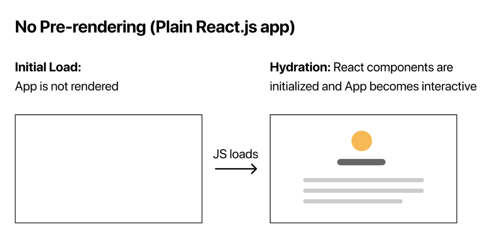

# CSR の問題点と Next.js の登場

- ファーストビューが遅い
- SEO が弱い

## Nextjs **Pages.Router 時代の突入**

SSR ができる React フレームワークとして 2016/10 に登場

Nextjs では Pre-Rendering（サーバー側で初期の HTML を生成）を行う。ハイドレーション用のミニマルな JS と共にクライアントへ送信。

※アクセス時に Pre-Rendering を行い、その後画面遷移は CSR と同じ

#


# SSR と SSG の登場

前述の Pre-Rendering(以下 PR) の技術こそが、**SSR・SSG（ISR）**。

- Sever Side Rendering（2016）
  PR のタイミングが**リクエスト時**
  用途：リアルタイムで変動するデータ
- Static Site Generator（2019）
  PR のタイミングが**ビルド時**
  用途：変動することがないデータ
- Incremental Static Regenerator（2020）
  PR のタイミングは、タイマー制（一定の期間で PR を作り直す）
  用途：少し変動するデータ（分類としては SSG）

# Pros and Cons

- SSR
  - （Pros）リクエストしたタイミングで生成するため、リアルタイムのデータを用いて描画できる
  - （Pros）ユーザーごとに内容を生成するため、プライベートな内容を含んでも問題となりづらい
  - （Cons）複雑なページは描画までに時間がかかる
  - （Cons）ネットワークを介するため、 CSR に比べるとユーザーからの入力に対するレスポンスは時間がかかる

#

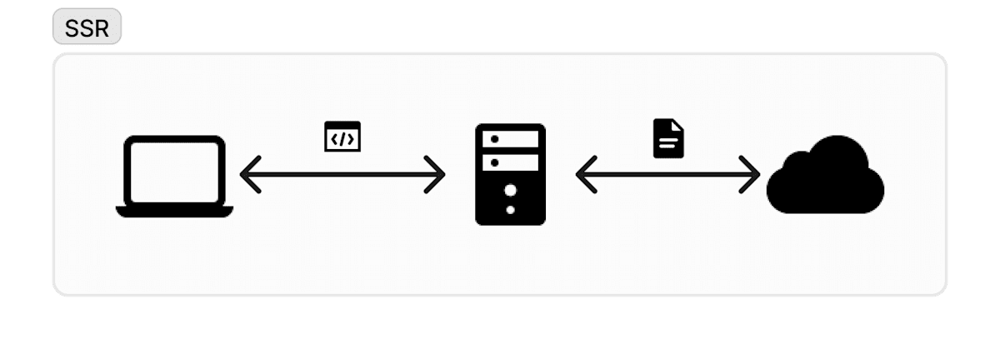

# Pros and Cons

- SSG
  - (Pros)リクエスト時に何も処理が走らないため、ユーザーの待ち時間はネットワークのみに依存する
  - (Pros)CDN による広域キャッシュが可能
  - (Cons)ユーザー全体を対象とするページ生成のため、個々のユーザーに向けたプライベートな内容を含むことができない。
  - (Cons)ユーザーからの入力を元にした動的な内容を生成できない

#

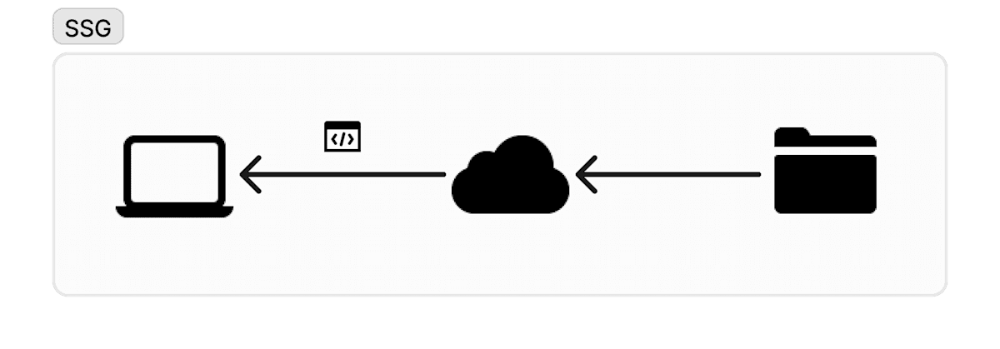

# Pros and Cons

- ISR
  - (Pros)SSG の Build 時間を短縮できる。
  - (Pros)SSR と比較したら DB 負荷は軽め。
  - (Cons)現段階では Nextjs フレームワーク依存。
  - (Cons)ユーザー全体を対象とするページ生成のため、個々のユーザーに向けたプライベートな内容を含むことができない。
  - (Cons)ユーザーからの入力を元にした動的な内容を生成できない

#


# これまでのまとめ

- 動的データの表示は SSR
- 静的データの表示は SSG

**トレードオフの関係**

動的データと用いたレンダリング：低速
↕
高速：静的データを用いたレンダリング

課題:

- **動的データを高速に表示したい**

- 動的データを表示する SSR には問題点が他にもある。後ほど説明

# SSG+Client Side Fetch(Client fetch)の登場

**ページ自体は SSG にしてクライアントサイドで動的データを fetch**

- 初期表示までが早い（ハイドレーションを除く）
- 複数回の HTTP ラウンドトリップ：
  通信やネットワーク、データ伝送などの分野では、通信相手に信号やデータを発信して、応答が帰ってくるまでの過程、回数
- CDN キャッシュが可能
- 実装が冗長
  クライアントサイド処理とサーバー側のエンドポイントを繋ぐ処理(API Routes、tRPC、GraphQL など)が必要

#

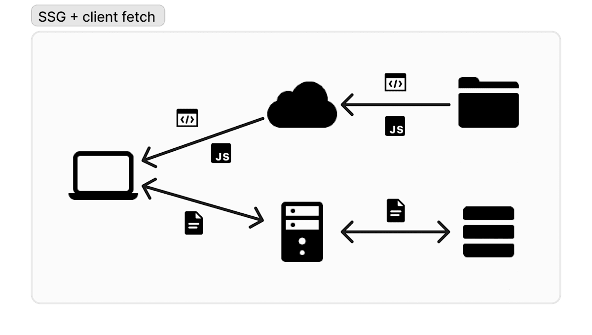

# App Router の登場（Next.js 13.4）2023.5

- App Router (Stable):

  - **React Server Components**
  - Nested Routes & Layouts
  - Simplified Data Fetching
  - **Streaming & Suspense**
  - Built-in SEO Support

  引用：[公式サイト](https://nextjs.org/blog/next-13-4)

# AppRouter によるパラダイムシフト

# DynamicRendering と StaticRendering

**AppRouter では、SSR,SSG,ISR とは呼ばない**

- static rendering: 従来の SSG や ISR 相当で、build 時や revalidate 実行後にレンダリング
  - revalidate なし: SSG 相当
  - revalidate あり: ISR 相当
- dynamic rendering: 従来の SSR 相当で、リクエストごとにレンダリング

# React Server Component

- React コンポーネントのレンダリングプロセスにおけるアーキテクチャのこと。

- RSC では、Server Components（SC）という新たな概念を持つコンポーネントが登場。RC とは、サーバー側でのみ実行されるコンポーネントです。サーバー側でのみ実行されるので、JS バンドルには含まれない。

これに付随して、嬉しいことがいっぱい！

# React Server Component の恩恵

- JS のバンドルサイズの削減
  Client 側のハイドレーションがなく JS の削減
- データフェッチスピードの高速化
  データベースに距離の近いサーバーサイドからアクセスできる
- 初期表示の改善
  StreamingHTML が利用できる
- セキュリティ
  トークンや API キーをクライアント側に公開せずアクセスできる。サーバー側で完結。
- 設計面のメリット
  データの取得処理の実装が容易

# 話をもどす

# SSR の問題点

- **ページ単位という制限**
  サーバー側の処理ができないと PR できないので、
  コンポーネントひとつだけでも処理が重いと、初期画面表示に時間がかかる。
  → **SSR StreamingHTML の登場**
- **常にクライアント側でハイドレーションを行う**
  SSR を使用しても、最終的にはクライアント上で JS によるハイドレーションが必要。クライアント側におくる JS が多くなる。
  → **SC によって解決**
- SSR 手法が標準化されていない
  ※テーマに直接的に関係しないので割愛

# StreamingHTML SSR の登場

Streaming HTML は、サーバーが HTML を小さな部分（チャンク）に分割して順番にブラウザに送信する技術。

ブラウザはページ全体がサーバーから送信されるのを待たずに、受信したチャンクを順に処理し、ユーザーに表示することができる。ユーザー体験が改善する。

- 初期表示までが早い（※SSG ほどではない）
- 一度の HTTP ラウンドトリップ：
  通信やネットワーク、データ伝送などの分野では、通信相手に信号やデータを発信して、応答が帰ってくるまでの過程、回数
- CDN キャッシュが不可
- 実装がシンプル

#

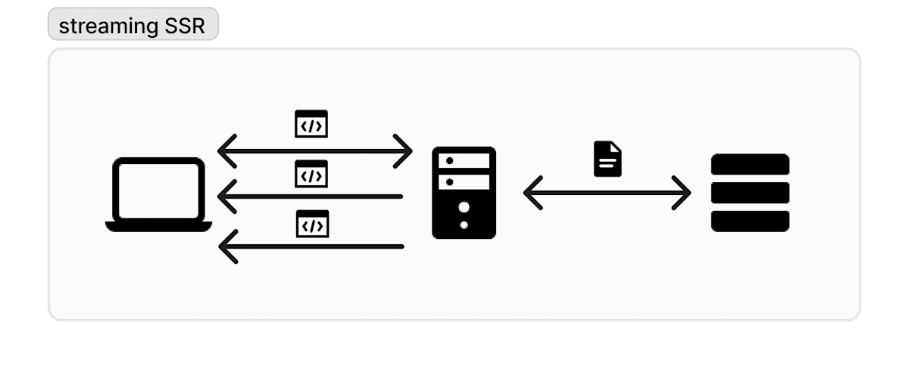

# 従来の SSR と StreamingHTML SSR

#

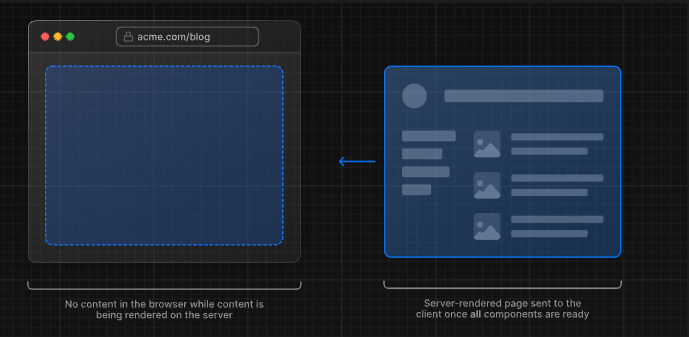

#

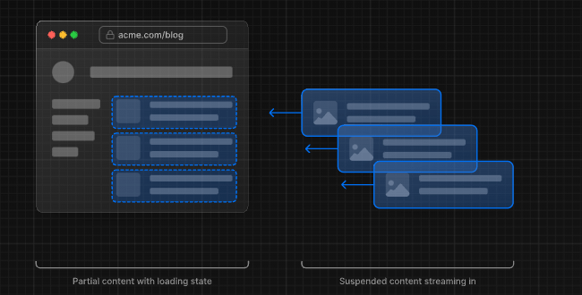

# Suspense × Streaming HTML の活用

処理に時間がかかるコンポーネントを待つ間 Spinner コンポーネントを表示できる。

```
import { Suspense } from "react";

export default function Home() {
  return (
    <Container>
      <NavBar />
      <SideBar />
      <Suspense fallback={<Spinner />}>
        <ServerComponent />
      </Suspense>
    </Container>
  );
}
```

#

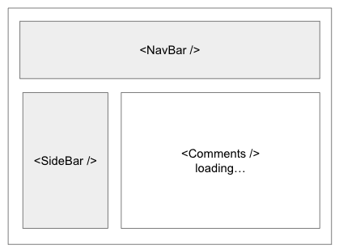

#


# SSG Client fetch VS Streaming HTML SSR

| 観点                  | SSG + Client fetch | Streaming SSR |
| --------------------- | ------------------ | ------------- |
| Time To First Bytes   | 有利               | 若干不利      |
| HTTP ラウンドトリップ | 複数回             | １回          |
| CDN キャッシュ        | 可能               | 不可          |
| 実装                  | 冗長になりがち     | シンプル      |

Streaming SSR は多くのメリットを持っている一方、
SSG が持つ TTFB の速度は得られないことがトレードオフ

# PPR 登場 - pre-rendering 新時代の到来

2024 年 7 月現在：開発中の機能

# PPR Partial Pre Rendering

**PPR は Streaming SSR をさらに進化させた技術で、
ページを static rendering としつつ、部分的に dynamic rendering にする**

SSG・ISR のページの一部に SSR な部分を組み合わせられるようなイメージ、
あるいは Streaming SSR の Suspense 部分 SSG/ISR にするイメージ。

#

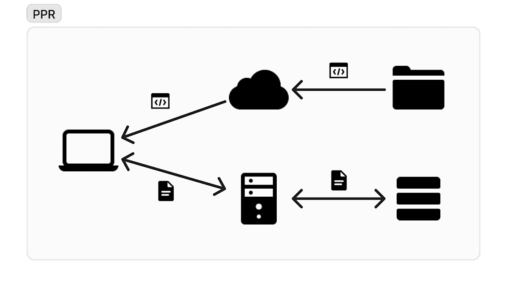

#


#

| 観点                  | Partial Pre-Rendering | SSG + Client fetch | Streaming SSR |
| --------------------- | --------------------- | ------------------ | ------------- |
| Time To First Bytes   | 有利                  | 有利               | 若干不利      |
| HTTP ラウンドトリップ | １回                  | 複数回             | １回          |
| CDN キャッシュ        | 不可                  | 可能               | 不可          |
| 実装                  | シンプル              | 冗長になりがち     | シンプル      |

PPR では SSG+Client fetch 相当の TTFB と実装のシンプルさを同時に得られる。HTML 内に動的な要素が含まれるため CDN キャッシュこそできないが、他の点においては SSG+Client fetch と Streaming SSR 両方のメリットを併せ持っている。

# まとめ

_MPA→SPA(CSR)→SSR→SSG→ISR→SSG+Client fetch→StreamingHTML SSR→PPR_ ← 今ここ

# 関連資料

[【Next.js x React18】SSR Streaming についてまとめてみた](https://zenn.dev/shinbey/articles/8acce14b8b60e3)
[【Next.js】RSC とクライアントコンポーネントを改めて理解する](https://zenn.dev/sc30gsw/articles/0941e76ae96260)
[【SSR、SSG、ISR でブログを作る】Nextjs14 初心者入門](https://zenn.dev/y_ta/books/eec3b78567aeeb/viewer/3a1d1f)
[[Next.js] SSR と React Server Components の相違点を理解する](https://zenn.dev/noko_noko/articles/7987456909978c)
