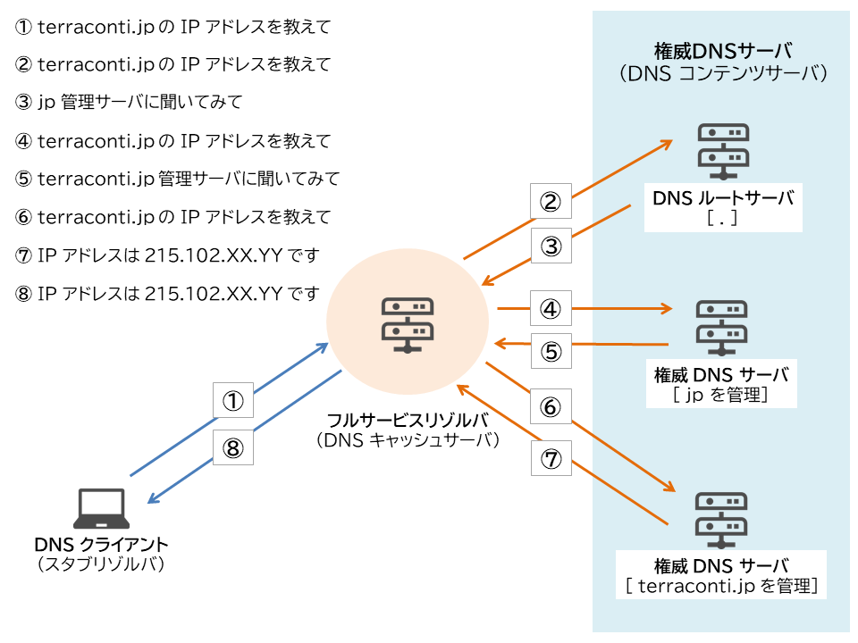
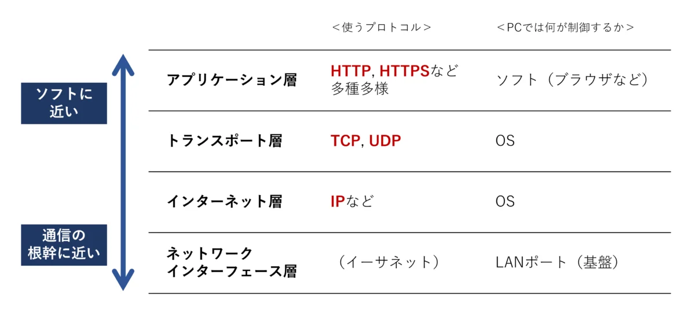

<!--
headingDivider: 1
-->

# _ネットワークはなぜ繋がるのか_

永田 佑斗

# 目的

**名著「ネットワークはなぜ繋がるのか」を要約する**

**ブラウザに URL を入力してからホームページが表示されるまで、何が行われているのかを理解する**

#


# 目次

1. Web ブラウザ
2. プロトコル・スタック、LAN アダプタ
3. ハブ、スイッチ、ルーター
4. アクセス回線、プロバイダ
5. ファイアーウォール、キャッシュ・サーバー
6. Web サーバー

# 第一章

**Web ブラウザがメッセージを作る**

~ブラウザ内部を探検~

    1. HTTPリクエスト・メッセージを作成する
    2. WebサーバーのIPアドレスをDNSサーバーに問い合わせる
    3. 世界中のDNSサーバーが連携する
    4. プロトコル・スタックにメッセージ送信を依頼する

# 1.1 HTTP リクエスト・メッセージを作成する

<!--
header: "_Webブラウザがメッセージを作る_ ＞ _HTTP リクエスト・メッセージを作成する_"
-->

URL の先頭でアクセスする方法を示す

- http:HTTP プロトコルで Web サーバーにアクセスする場合
- ftp:FTP プロトコルでファイルをダウンロードしたりアップロードする場合
- file:クライアント・パソコン自身のファイルからデータを読み込む場合
- mailto:メールを送信する場合
- news:ニュース・グループの記事を読む場合

#

（例）http: // www.lab.glasscom.com / dir1/file1.html

- http は、データ限にアクセスする仕組み、つまりプロトコル
- www.lab.glasscom.comは、 Web サーバー名
- dir1 以降は、データ源（ファイル）のパス名

# HTTP プロトコルとは

HTTP プロトコルとは、クライアントとサーバーがやりとりするメッセージの内容

- リクエストメッセージ：「何を」「どうして」を含む
- レスポンスメッセージ：リクエストメッセージの結果生じるデータ

# リクエストメッセージ

- URI：「何を」の部分。
  アクセス先をデータを格納したファイルの名前や CGI プログラム、URL を指す
  ※CGI：Web サーバーからプログラムを呼び出す時のルールを定めたもの
  ※CGI プログラム：CGI に則った動くプログラム
- メソッド：「どうして」の部分
  GET:URI で指定した情報を取り出す。ファイルの場合はファイルの中身、CGI プログラムは出力データを返す
  POST:クライアントからサーバーにデータを送信する。フォームに入力したデータの送信など。
  URI には、Web サーバーで動作するアプリケーションプログラムを書く
  ※アプリケーションプログラム：.cgi や.php の注文データやアンケートデータの処理プログラム

# レスポンスメッセージ

- ステータスコード:実行結果が正常終了か異常かを示す

# HTTP リクエストメッセージを作る

リクエストメッセージ

```
<メソッド><空白><URI><空白><HTTPバージョン>
<フィールド名>:<フィールド値>
・・・
・・・
・・・
<空白行>
<メッセージ・ボディ>
```

#

- リクエスト・ライン

```
<メソッド><空白><URI><空白><HTTPバージョン>
```

リクエストの内容が大体わかる

※GET でも入力したデータを付加することができるが、データ量が数百バイトを超える場合は、POST を利用する

#

- メッセージ・ヘッダー

```
<フィールド名>:<フィールド値>
・・・
・・・
・・・
```

付加的な細かい情報が必要になる場合、書き留めておくのがメッセージ・ヘッダーの役割。
フィールドには、日付、クライアント側が扱えるデータの種類、言語、圧縮の形式、クライアントやサーバーのソフトウェア名称やバージョンなどがある。
数行から、10 数行のメッセージヘッダーが大半。

#

- メッセージ・ボディ

```
<空白行>
<メッセージ・ボディ>
```

メッセージヘッダーから空行を挟んで、送信するデータを書く。メッセージの本体。

メソッドが GET の場合、メソッドと URI だけで、Web サーバーは何をすべきか判断できるので、メッセージボディに書く送信データは何もない。
メソッドが POST の場合、フォームに入力したデータなどはメッセージボディに記述する。

# リクエストを送るとレスポンスが返ってくる

レスポンスメッセージ（詳しくは 6 章）
一行目のみ異なる

```
<HTTPバージョン><空白><ステータスコード><空白><レスポンスフレーズ>
<フィールド名>:<フィールド値>
・・・
・・・
・・・
<空白行>
<メッセージ・ボディ>
```

#

- ステータス・ライン

```
<HTTPバージョン><空白><ステータスコード><空白><レスポンスフレーズ>
```

ステータス・コード：正常終了したのか、エラーが起きたのかリクエストの実行結果を**数字**表す

| コード値 | 説明                             | コード値 | 説明                 |
| -------- | -------------------------------- | -------- | -------------------- |
| 1xx      | 処理の経過                       | 4xx      | クライアント側エラー |
| 2xx      | 通常終了                         | 5xx      | サーバー側エラー     |
| 3xx      | 何らかの別アクションが必要である |          |                      |

レスポンス・フレーズ：人間に実行結果を知らせるために**文章**で表す

#

- レスポンスメッセージ

  ページが文書だけであれば、レスポンス１度で完了。

  しかし、**画像を含む場合は複数回のリクエストとレスポンスが必要。**
  リクエスト一回につき、URI は一つしか書けないので、画像に対応する URI でリクエストを作成する必要がある。

# 1.2 Web サーバーの IP アドレスを DNS サーバーに問い合わせる

<!--
header: "_Webブラウザがメッセージを作る_ ＞ _Web サーバーの IP アドレスを DNS サーバーに問い合わせる_"
-->

#

ブラウザは、URL を解読し、HTTP メッセージを作る機能はあるが、**そのメッセージをネットワークに送り出す機能を持っていない**。そのため、OS に依頼して送ってもらう。

そのために、まずは、**URL 中に記載してあるドメイン名を IP アドレスに変換する**。

#

## IP アドレスについて

インターネットや社内の LAN は、TCP/IP の考え方に基づいて作られている。

TCP/IP の基本的な考え方は、**サブネット（小さなネットワーク）をルーターで接続することによって、全体のネットワークが出来上がっている**という考え方。

イメージ
「〇〇丁目 △△ 番地」を（IP アドレス）
〇〇丁目をサブネット（ネットワーク番号）
△△ 番地 をコンピューター（ホスト番号）

#

## IP アドレスについてもっと詳しく

IP アドレスのルールでは、ネットワーク番号とホスト番号合わせて 32 ビットと決まっているだけで、内訳が決まっていない。
その内訳を示す情報を**ネットマスク**という。

※余談
旧クラスフル方式：ネットワーク部とホスト部が固定
→ 使わない IP アドレスが多くなる
クラスレス方式：IP アドレスの発行数が柔軟になる

#

1. IP アドレス本体の表記方法
   _10.11.12.13_
2. IP アドレス本体と同じ方法でネットマスクを表記する方法
   _10.11.12.13/255.255.255.0_
3. ネット番号のビット数でネットマスクを表記する方法
   _10.11.12.13/24_

## IP アドレスの特殊なホスト番号

- 全て 0:サブネット全体
  _10.11.12.0/24_
- 全て 1:サブネット上にある機器全員にパケットを送付する**ブロードキャスト**
  _10.11.12.255/24_

#

名前がわかれば、IP アドレスがわかる。
IP アドレスがわかれば、名前がわかる

この仕組みが**Domain Name System：DNS**

最寄りの DNS サーバーに「www.〇〇〇〇.com のというサーバーの IP アドレスを教えてください」と問い合わせる。すると、DNS サーバーが
「そのサーバーの IP アドレスは、xxx.xxx.xxx.xxx です」と教えてくれる。

#

## DNS をもう少し詳しく

DNS の仕組みを使って IP アドレスを調べることを**ネーム・リゾリューション**（名前解決）と呼ぶ。
また、DNS サーバーに対して問い合わせるので、問い合わせ元（DNS クライアント）に相当するものを**DNS リゾルバ**あるいは**リゾルバ**と呼ぶ。

リゾルバの実態は、**Socket ライブラリ**の一機能である。

Socket ライブラリとは、OS に組み込まれているネットワーク機能をアプリケーションから呼び出すための部品を集めたもの。

→**ドメイン名から IP アドレスを調べるとき、ブラウザは Socket ライブラリのリゾルバを利用する。**

#

アプリケーションプログラム
↕️
Socket
↕️
OS 内部のプロトコル・スタック
※OS 内部に組み込まれたネットワーク制御用ソフトウェア
↕️
LAN アダプタ
↕️
DNS サーバー
※DNS サーバーへの IP アドレスは予め設定されてるため、調べる必要がない。

# 1.３ 世界中の DNS サーバーが連動する

<!--
header: "_Webブラウザがメッセージを作る_ ＞ _世界中のDNSサーバーが連動する_"
-->

#

## DNS サーバーの基本動作

1. クライアントから問い合わせメッセージ（名前、クラス、タイプ）

- 名前
  サーバーやメール配送先（@以降の名前）
- クラス
  IN（インターネット）現在はそれ以外にない
- タイプ
  タイプ A:IP アドレスが紐付いている
  タイプ MX:メールの配送先が対応づけられている

2. DNS サーバーで登録された情報（**リソースレコード**）を探す
3. 名前に対応する返答項目を返す
   DNS の問い合わせメッセージ

#

## DNS サーバーがどのようにして IP アドレスと取得するのか

各ドメインの階層に分けて DNS サーバーに登録されている。

（例 www.nikkeibp.co.jp）

ルートドメイン → jp（トップレベル・ドメイン） → co → nikkeibp → www

※インターネットに存在する DNS サーバー全てにルートドメインの DNS サーバーを登録してある

#



#

## DNS サーバーはキャッシュ機能で素早く回答

DNS サーバーは一度調べた名前を**キャッシュ**(一度使ったデータを場所に近いところの高速な記憶装置に保管し、2 回目以降の利用を高速化する技術)に記憶しておく機能がある。
※問い合わせた名前がドメインに登録されていない場合もキャッシュする

注意点
キャッシュに情報が登録された後、登録情報が変更される場合もあるので、正しいとは限らない。そのため、DNS サーバーに登録する情報に有効期限を設定する。また、回答がキャッシュからなのか、登録元なのかを知らせることになっている

# 1.4 プロトコル・スタックにメッセージ送信を依頼する

<!--
header: "_Webブラウザがメッセージを作る_ ＞ _プロトコル・スタックにメッセージ送信を依頼する_"
-->

#

IP アドレスを調べたら、その IP アドレスの相手、アクセス先の Web サーバーにメッセージを送信するように OS 内部にある**プロトコルスタック**に依頼する。
なお、**メッセージ送信動作を依頼するときは、Socket ライブラリのプログラム部品を決められた順に呼びだす。**

データの送受信動作のイメージはパイプのようなものでサーバーとクライアントを繋ぎ、その中をデータが移動する。出入口を**ソケット**と呼ぶ。

#

## データの送受信動作

※この動作は アプリケーションではなく、**OS のプロトコル・スタック**が行う

1. ソケットを作る（ソケット作成フェーズ）
2. サーバー側のソケットにパイプを繋ぐ（接続フェーズ）
3. データを送受信する（送受信フェーズ）
4. パイプを外してソケットを抹消する（切断フェーズ）

#

## ソケット作成フェーズ

1. Socket ライブラリの socket プロブラムを呼び出して、ソケットを作る。
   ※Socket:ライブラリ,socket:プログラム, ソケット:出入口
2. ソケットができたら、**ディスクリプタ**が返却される
   ディスクリプタとは、複数のソケットが一つのコンピュータに存在するときの識別記号

**アプリケーションは「ディスクリプタ」という番号札のようなものでソケットを識別する。**

#

## 接続フェーズ

できあがったソケットをサーバー側のソケットに接続するようにプロトコルスタックに依頼する。

Socket ライブラリの connect プログラムを呼び出して、ソケットを接続する。
**ディスクリプタ、サーバーの IP アドレス、ポート番号**の 3 つを引数にもつ。

- IP アドレスは、ネットワーク上のコンピュータまでしか特定できない。IP アドレスと**ポート番号**を用いて、サーバー側のソケットまで特定する。
- ディスクリプタは一台のコンピュータ内部でソケットを認識するために使用する
- ポート番号は接続相手側からソケットを認識するために使う。
  なお、サーバー側のポート番号はアプリケーションの種類によって予め決められた値を使う。（例）Web:80 メール:25
- 相手の IP アドレスとポート番号はソケットに記録する

#

## 送受信フェーズ

- 送信は Socket ライブラリの write
  write には**ディスクリプタと送信データ**を指定する。
  送信データは、HTTP リクエスト・メッセージのこと
- 受信は Socket ライブラリの read
  受信バッファ（受信したレスポンス・メッセージを格納するためのメモリー領域）を指定する。
  受信バッファは、アプリケーション・プログラム内部に用意したメモリー領域なので、受信バッファにメッセージを格納した時点でメッセージをアプリケーションに渡したことになる。

#

## 切断フェーズ

- 切断は、Socket ライブラリの close
  Web サーバーがレスポンスを返したタイミングで、Web サーバーから close を呼び出して切断する。
  その後、クライアントが側で切断される。

#

HTTP プロトコルは HTML ドキュメントや画像のデータを一つひとつ別々のものとして扱い、一つのデータを読み出す都度**接続、リクエスト・メッセージ送信、レスポンス・メッセージ受信、切断**を繰り返す。

# 第二章

<!--
header: "_TCP/IPのデータを電気信号にして送る_ "
-->

**TCP/IP のデータを電気信号にして送る**

~プロトコル・スタックと LAN アダプタを探索~

    1. ソケットを作成する
    2. サーバーに接続する
    3. データを送受信する
    4. サーバーから切断してソケットを抹消
    5. IPとイーサネットのパケット送受信動作
    6. UDPプロトコルを用いた送受信動作

# 2.1 ソケットを作成する

<!--
header: "_TCP/IPのデータを電気信号にして送る_ ＞ _ソケットを作成する_"
-->

**プロトコル・スタック**：OS に組み込まれたネットワーク制御用ソフトウェア
**LAN アダプタ**：ネットワーク用ハードウェア
のふたつがブラウザから受け取ったメッセージをサーバーに送り出す動きを学ぶ

#

- アプリケーション層の最下部に Socket ライブラリ（その中にリゾルバがある）がある
- TCP,UDP,IP を合わせてプロトコル・スタック
- TCP,UDP どちらもデータを送受信するプロトコル。
- TCP はブラウザやメールなどの通常のアプリケーションを、UDP は DNS サーバーへの問い合わせなどの短い制御用のデータを担当する。
- IP とは、パケット（インターネットでデータを運ぶための小分けデータ）を運ぶときに発生するエラーを検知、制御用メッセージを通知する**ICMP**と IP アドレスをイーサネットの MAC アドレスに変換する**ARP**がある。
- ネットワークインターフェース層は**LAN ドライバ**で LAN アダプタのハードウェアを制御する。
- LAN アダプタが実際の送受信動作、つまりケーブルに対して信号を送受信する

#



#

## ソケットの実体は、通信制御用の制御情報

プロトコルスタックは、内部に制御情報を記録するメモリー領域を持ち、そこに通信動作を制御するための制御情報を記録する。
**制御情報**とは、通信相手の IP アドレス、ポート番号、通信動作がどのような進行状態なのかなどが挙げられる。
本来ソケットは、概念的で実体は存在しないが、**この制御情報を記録したメモリー領域がソケットの実体**といっていい。
プロトコルスタックは、ソケットに記録した制御情報をもとに動く。

# 2.1.3 から
