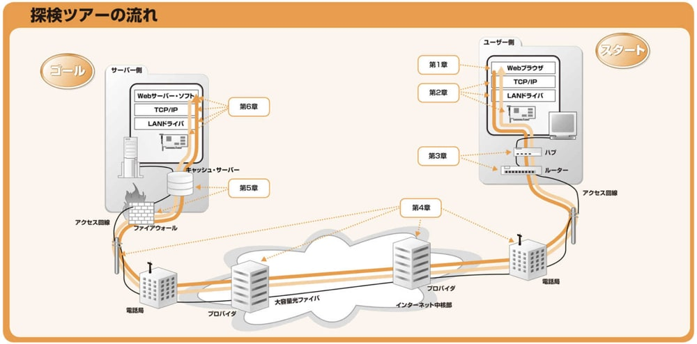

<!--
headingDivider: 1
-->

# _ネットワークはなぜ繋がるのか_

永田 佑斗

# 目的

**名著「ネットワークはなぜ繋がるのか」を要約する**

**ブラウザに URL を入力してからホームページが表示されるまで、何が行われているのかを理解する**

#



# 目次

1. Web ブラウザ
2. プロトコル・スタック、LAN アダプタ
3. ハブ、スイッチ、ルーター
4. アクセス回線、プロバイダ
5. ファイアーウォール、キャッシュ・サーバー
6. Web サーバー

# 第一章

**Web ブラウザがメッセージを作る**
~ブラウザ内部を探検~

    1. HTTPリクエスト・メッセージを作成する
    2. WebサーバーのIPアドレスをDNSサーバーに問い合わせる
    3. 世界中のDNSサーバーが連携する
    4. プロトコル・スタックにメッセージ送信を依頼する

# 1.1 HTTP リクエスト・メッセージを作成する

URL の先頭でアクセスする方法を示す

- http:HTTP プロトコルで Web サーバーにアクセスする場合
- ftp:FTP プロトコルでファイルをダウンロードしたりアップロードする場合
- file:クライアント・パソコン自身のファイルからデータを読み込む場合
- mailto:メールを送信する場合
- news:ニュース・グループの記事を読む場合

#

（例）http: // www.lab.glasscom.com / dir1/file1.html

- http は、データ限にアクセスする仕組み、つまりプロトコル
- www.lab.glasscom.comは、 Web サーバー名
- dir1 以降は、データ源（ファイル）のパス名

# HTTP プロトコルとは

HTTP プロトコルとは、クライアントとサーバーがやりとりするメッセージの内容

- リクエストメッセージ：「何を」「どうして」を含む
- レスポンスメッセージ：リクエストメッセージの結果生じるデータ

# リクエストメッセージ

- URI：「何を」の部分。
  アクセス先をデータを格納したファイルの名前や CGI プログラム、URL を指す
  ※CGI：Web サーバーからプログラムを呼び出す時のルールを定めたもの
  ※CGI プログラム：CGI に則った動くプログラム
- メソッド：「どうして」の部分
  GET:URI で指定した情報を取り出す。ファイルの場合はファイルの中身、CGI プログラムは出力データを返す
  POST:クライアントからサーバーにデータを送信する。フォームに入力したデータの送信など。
  URI には、Web サーバーで動作するアプリケーションプログラムを書く
  ※アプリケーションプログラム：.cgi や.php の注文データやアンケートデータの処理プログラム

# レスポンスメッセージ

- ステータスコード:実行結果が正常終了か異常かを示す

# HTTP リクエストメッセージを作る

リクエストメッセージ

```
<メソッド><空白><URI><空白><HTTPバージョン>
<フィールド名>:<フィールド値>
・・・
・・・
・・・
<空白行>
<メッセージ・ボディ>
```

#

- リクエスト・ライン

```
<メソッド><空白><URI><空白><HTTPバージョン>
```

リクエストの内容が大体わかる

※GET でも入力したデータを付加することができるが、データ量が数百バイトを超える場合は、POST を利用する

#

- メッセージ・ヘッダー

```
<フィールド名>:<フィールド値>
・・・
・・・
・・・
```

付加的な細かい情報が必要になる場合、書き留めておくのがメッセージ・ヘッダーの役割。
フィールドには、日付、クライアント側が扱えるデータの種類、言語、圧縮の形式、クライアントやサーバーのソフトウェア名称やバージョンなどがある。
数行から、10 数行のメッセージヘッダーが大半。

#

- メッセージ・ボディ

```
<空白行>
<メッセージ・ボディ>
```

メッセージヘッダーから空行を挟んで、送信するデータを書く。メッセージの本体。

メソッドが GET の場合、メソッドと URI だけで、Web サーバーは何をすべきか判断できるので、メッセージボディに書く送信データは何もない。
メソッドが POST の場合、フォームに入力したデータなどはメッセージボディに記述する。

# リクエストを送るとレスポンスが返ってくる

レスポンスメッセージ（詳しくは 6 章）
一行目のみ異なる

```
<HTTPバージョン><空白><ステータスコード><空白><レスポンスフレーズ>
<フィールド名>:<フィールド値>
・・・
・・・
・・・
<空白行>
<メッセージ・ボディ>
```

#

- ステータス・ライン

```
<HTTPバージョン><空白><ステータスコード><空白><レスポンスフレーズ>
```

ステータス・コード：正常終了したのか、エラーが起きたのかリクエストの実行結果を**数字**表す

| コード値 | 説明                             | コード値 | 説明                 |
| -------- | -------------------------------- | -------- | -------------------- |
| 1xx      | 処理の経過                       | 4xx      | クライアント側エラー |
| 2xx      | 通常終了                         | 5xx      | サーバー側エラー     |
| 3xx      | 何らかの別アクションが必要である |          |                      |

レスポンス・フレーズ：人間に実行結果を知らせるために**文章**で表す

#

- レスポンスメッセージ

  ページが文書だけであれば、レスポンス１度で完了。

  しかし、**画像を含む場合は複数回のリクエストとレスポンスが必要。**
  リクエスト一回につき、URI は一つしか書けないので、画像に対応する URI でリクエストを作成する必要がある。

# 1.2 Web サーバーの IP アドレスを DNS サーバーに問い合わせる

#

ブラウザは、URL を解読し、HTTP メッセージを作る機能はあるが、**そのメッセージをネットワークに送り出す機能を持っていない**。そのため、OS に依頼して送ってもらう。

そのために、まずは、**URL 中に記載してあるドメイン名を IP アドレスに変換する**。

#

## IP アドレスについて

インターネットや社内の LAN は、TCP/IP の考え方に基づいて作られている。

TCP/IP の基本的な考え方は、**サブネット（小さなネットワーク）をルーターで接続することによって、全体のネットワークが出来上がっている**という考え方。

イメージ
「〇〇丁目 △△ 番地」を（IP アドレス）
〇〇丁目をサブネット（ネットワーク番号）
△△ 番地 をコンピューター（ホスト番号）

#

## IP アドレスについてもっと詳しく

IP アドレスのルールでは、ネットワーク番号とホスト番号合わせて 32 ビットと決まっているだけで、内訳が決まっていない。
その内訳を示す情報を**ネットマスク**という。

※余談
旧クラスフル方式：ネットワーク部とホスト部が固定
→ 使わない IP アドレスが多くなる
クラスレス方式：IP アドレスの発行数が柔軟になる

#

## IP アドレスの特殊なホスト番号

- 全て 0:サブネット全体
- 全て 1:サブネット上にある機器全員にパケットを送付する**ブロードキャスト**

#

名前がわかれば、IP アドレスがわかる。
IP アドレスがわかれば、名前がわかる

この仕組みが**Domain Name System：DNS**

最寄りの DNS サーバーに「www.〇〇〇〇.com のというサーバーの IP アドレスを教えてください」と問い合わせる。すると、DNS サーバーが
「そのサーバーの IP アドレスは、xxx.xxx.xxx.xxx です」と教えてくれる。

#

## DNS をもう少し詳しく

DNS の仕組みを使って IP アドレスを調べることを**ネーム・リゾリューション**（名前解決）と呼ぶ。
また、DNS サーバーに対して問い合わせるので、問い合わせ元（DNS クライアント）に相当するものを**DNS リゾルバ**あるいは**リゾルバ**と呼ぶ。

リゾルバの実態は、**Socket ライブラリ**の一機能である。

Socket ライブラリとは、OS に組み込まれているネットワーク機能をアプリケーションから呼び出すための部品を集めたもの。

→**ドメイン名から IP アドレスを調べるとき、ブラウザは Socket ライブラリのリゾルバを利用する。**

#

アプリケーションプログラム
↕️
Socket
↕️
OS 内部のプロトコル・スタック
※OS 内部に組み込まれたネットワーク制御用ソフトウェア
↕️
LAN アダプタ
↕️
DNS サーバー
※DNS サーバーへの IP アドレスは予め設定されてるため、調べる必要がない。
