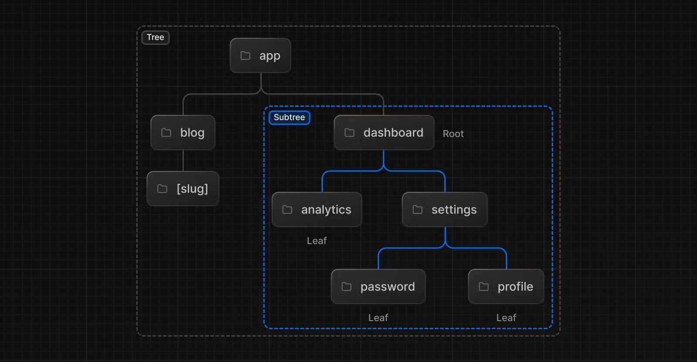
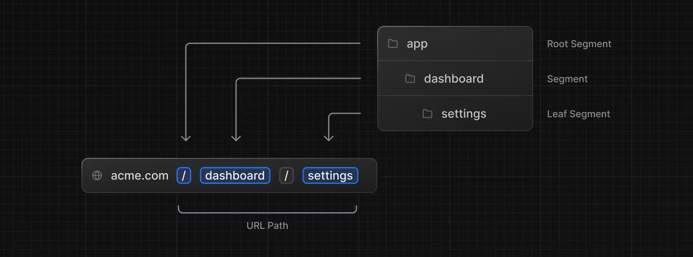

<!--
headingDivider: 1
-->

# _Next.js Documents Summary_

[Next.js Docs 　日本語版](https://ja.next-community-docs.dev/docs/app-router/building-your-application/)

[Next.js Docs 　英語版](https://nextjs.org/docs/app/building-your-application)

_永田 佑斗_

# memo

https://marpit.marp.app/directives?id=local-directives-1
ナビゲーション
クライアントサイドナビゲーション
https://zenn.dev/miyaken0805/articles/c19bada3b1825a
https://zenn.dev/miyaken0805/articles/ce661b45e7fe2f
クライアントサイドルーティング

# Table of contents

- Routing
- Data Fetching
- Rendering
- Caching
- Styling
- Optimizing
- Configuring
- Testing
- Authentication
- Deploying
- Upgrading

# Routing

<!-- header: _Building Your Application_ > _Routing_-->

- Defining Routes
- Pages and Layouts
- Linking and Navigating
- Loading UI and Streaming
- Error Handling
- Redirecting
- Route Groups
- Project Organization
- Dynamic Routes
- Parallel Routes
- Intercepting Routes
- Route Handlers
- Middleware
- Internationalization

#


#



# Defining Routes

<!-- header: _Building Your Application_ > _Routing_ > _Defining Routes_-->

#

Next.js では、フォルダを使ってルートを定義する、ファイルシステムベースの Router

#



# Pages and Layouts

<!-- header: _Building Your Application_ > _Routing_ > _Pages and Layouts_-->

# Linking and Navigating

<!-- header: _Building Your Application_ > _Routing_ > _Linking and Navigating_-->

# Loading UI and Streaming

<!-- header: _Building Your Application_ > _Routing_ > _Loading UI and Streaming_-->

# Error Handling

<!-- header: _Building Your Application_ > _Routing_ > _Error Handling_-->

# Redirecting

<!-- header: _Building Your Application_ > _Routing_ > _Redirecting_-->

# Route Groups

<!-- header: _Building Your Application_ > _Routing_ > _Route Groups_-->

# Project Organization

<!-- header: _Building Your Application_ > _Routing_ > _Project Organization_-->

# Dynamic Routes

<!-- header: _Building Your Application_ > _Routing_ > _Dynamic Routes_-->

# Parallel Routes

<!-- header: _Building Your Application_ > _Routing_ > _Parallel Routes_-->

# Intercepting Routes

<!-- header: _Building Your Application_ > _Routing_ > _Intercepting Routes_-->

# Route Handlers

<!-- header: _Building Your Application_ > _Routing_ > _Route Handlers_-->

# Middleware

<!-- header: _Building Your Application_ > _Routing_ > _Middleware_-->

# Internationalization

<!-- header: _Building Your Application_ > _Routing_ > _Internationalization_-->

# Data Fetching

<!-- header: _Building Your Application_ > _Data Fetching_ -->

- Fetching, Caching, and Revalidating
- Server Actions and Mutations
- Data Fetching Patterns and Best Practices

# Data Fetching, Caching, and Revalidating

<!-- header: _Building Your Application_ > _Data Fetching_ > _Data Fetching, Caching, and Revalidating_-->

## 4 つのデータのフェッチの方法。

1. fetch を使用したサーバー上でのデータフェッチ
2. サードパーティライブラリを使用したサーバー上でのデータフェッチ
3. ルートハンドラを介したクライアント上でのデータフェッチ
4. サードパーティライブラリを使用したクライアント上でのデータフェッチ

#

**Server Side fetch vs Client Side fetch**

- **サーバーサイドデータフェッチ**
  初期ページロードの最適化、SEO 対策、データの安全性向上、パフォーマンス向上のために使用します。
- **クライアントサイドデータフェッチ**
  ユーザーインタラクション後のデータ取得、初期ページロード後のデータ更新、クライアント特有の状態管理のために使用します。
  ルートハンドラはサーバー上で実行されるため、クライアントからルートハンドラを呼び出す必要がある。（API トークンのような機密情報をクライアントに公開したくないときに便利）

#

## fetch を使用したサーバー上でのデータフェッチ

- Next.js はネイティブの fetch Web API を拡張し、サーバー上の各 fetch リクエストに対する**キャッシュと再検証**の動作を設定できる。
- async/await を使用した Server Components、Route ハンドラおよび Server Actions で fetch を使用する。

#

## 前提知識

**非同期処理**

同期処理だとデータが取り終わるまで画面が表示されない。
→ バックグラウンドで処理を行おう！（非同期処理）メインスレッドから切り離して処理を行う。setTimeout()
→ コールバック地獄（ネストが深い読みずらいコード）
→Promise の誕生：then を使って、連続した非同期処理をフラットにかける＆「後で値返すから待っててね」の意＆状態を持つ
→async/await 非同期処理を普通に書けるようになった

#

async/await の例

```
func = async ()=>{
  await log(3);
  await log(2);
  await log(1);
}

log=(num)=>{
  return new Promise(resolve=>{
    setTimeout(()=>{
      console.log(num);
      resolve();
    },1000)
  })
}
```

#

async キーワードを使って宣言された関数は、常に Promise を返す。
具体的には、async 関数は次のような特徴を持つ。

1. Promise を返す：async 関数は、結果を Promise として返します。関数内で await を使用して非同期処理の結果を待つことができます。
2. await を使用できる：async 関数内では await キーワードを使って、Promise の解決（もしくは拒否）を待つことができます。await は Promise の解決を一時停止し、その結果を変数に格納します。

[JavaScript の Promise 徹底攻略-前編-【Promise とは/非同期処理】](https://www.youtube.com/watch?v=ItyLZ1Df8zw)

#

app/page.tsx

```
async function getData() {
  const res = await fetch('https://api.example.com/...')
  // 返り値はシリアライズされない
  // Date, Map, Setを返すことができる

  if (!res.ok) {
    // 最も近い`error.js`エラーバウンダリが有効になる。
    throw new Error('Failed to fetch data')
  }

  return res.json()
}

export default async function Page() {
  const data = await getData()

  return <main></main>
}
```

#

処理の順番

1. "page"関数が呼ばれる

- Page 関数が呼び出されると、まずその関数内で getData 関数が呼ばれます。
- Page 関数は async 関数として定義されているため、Promise を返します。

2. getData 関数の実行

- Page 関数内で await getData()が呼ばれると、getData 関数が非同期に実行されます。
- getData 関数内で次の操作が行われます
  1. fetch の呼び出し
     ※fetch 関数は、もともと Promise を返す関数であるため、await はその Promise が解決（または拒否）されるのを待つ。
  2. レスポンスの検証
  3. レスポンスの JSON データを格納

#

3. Page 関数の実行再開

- getData 関数が解決され、データが取得されると、Page 関数の実行が再開されます。
- const data = await getData()が完了し、data に取得されたデータが格納されます。

4. Page 関数の戻り値

- 最後に、Page 関数は<main></main>を返します。

#

## fetch("url")で返却される Response オブジェクト

fetch() 関数は Promise を返します。このプロミスはサーバーのレスポンスを表す Response オブジェクトで履行されます。
| プロパティ/メソッド | 説明 |
| ---------------------- | ----------------------------------------------------------------------------------------------------------------- |
| **プロパティ** | |
| Response.body | 本文のコンテンツの ReadableStream です。 |
| Response.bodyUsed | 本文がレスポンスで使用されたかどうかを定義する論理値が格納されます。 |
| Response.headers | レスポンスに関連した Headers オブジェクトが入ります。 |
| **Response.ok** | レスポンスが成功 (200–299 の範囲のステータス) したか否かを通知する論理値が入ります。 |
| Response.redirected | レスポンスがリダイレクトの結果であるかどうかを示します。 |
| Response.status | このレスポンスのステータスコードを返します (成功ならば 200 になります)。 |
| Response.statusText | ステータスコードに対応したステータスメッセージが入ります (たとえば 200 ならば OK)。 |
| Response.trailers | Promise であり、Headers オブジェクトを返します。これは Response.headers にある HTTP の Trailer ヘッダーの値です。 |
| Response.type | レスポンスの種類です。 (例えば basic, cors) |
| Response.url | レスポンスの URL を返します。 |
| **メソッド** | |
| Response.arrayBuffer() | レスポンスの本体を表す ArrayBuffer で解決するプロミスを返します。 |
| Response.blob() | レスポンスの本体を表す Blob で解決するプロミスを返します。 |
| Response.clone() | Response オブジェクトの複製を生成します。 |
| Response.error() | ネットワークエラーに関連した新しい Response オブジェクトを返します。 |
| Response.formData() | レスポンスの本体を表す FormData で解決するプロミスを返します。 |
| **Response.json()** | レスポンスの本体のテキストを JSON として解釈した結果で解決するプロミスを返します。 |
| Response.redirect() | 異なる URL で新しいレスポンスを生成します。 |
| Response.text() | レスポンスの本体のテキスト表現で解決するプロミスを返します。 |

#

## fetch を使用したサーバー上でのデータフェッチ

サーバーサイドフェッチは pre-rendering（初期表示に係るデータフェッチ）

#

## Nextjs cookie と headers

HTTP 通信はステートレスである。cookie を使って状態維持。
特定のユーザーに特定のページを送るには、cookie を用いたセッション管理が必要。
cookie ブラウザでテキスト情報を保存する仕組み
HTTP リクエストの際に cookie を含めることで、特定のユーザーにレスポンスを返すことが出来る。

- cookie
  Server Components から HTTP 受信リクエストの Cookies を読み取ったり、Server Action や Route Handler の送信リクエストに Cookies を書き込むことができる
- headers
  サーバーコンポーネントから HTTP の受信リクエストヘッダーを読み込むことが出来る

#

```
//データのキャッシュ
fetch('https://...', { cache: 'force-cache' })
```

```
//データの再検証
//1データの再検証
fetch('https://...', { next: { revalidate: 3600 } })
//2ルートセグメントすべてのfetchリクエストを再検証
export const revalidate = 3600
```

```
//データのキャッシュを停止
fetch('https://...', { cache: 'no-store' })
```

#

## サードパーティライブラリを使用したサーバー上でのデータフェッチ

割愛

#

## ルートハンドラを介したクライアント上でのデータフェッチ

Client Components でデータを取得する必要がある場合、クライアントからルートハンドラを呼び出すことができます。ルートハンドラはサーバー上で実行され、クライアントにデータを返します。これは、API トークンのような機密情報をクライアントへ公開したくない場合に便利。

Server Components はサーバー上でレンダリングされるため、データを取得するために Server Component からルートハンドラを呼び出す必要はありません。代わりに、Server Component 内で直接データを取得できる。

#

## サードパーティライブラリを使用したクライアント上でのデータフェッチ

割愛

# Server Actions and Mutations

<!-- header: _Building Your Application_> _Data Fetching_ > _Server Actions and Mutations_-->

# Data Fetching Patterns and Best Practices

<!-- header: _Building Your Application_> _Data Fetching_ > _Data Fetching Patterns and Best Practices_-->

# Rendering

<!-- header: _Building Your Application_ > _Rendering_-->

- Server Components
- Client Components
- Composition Patterns
- Edge and Node.js Runtimes

# Server Components

<!-- header: _Building Your Application_ > _Rendering_> _Server Components_-->

# Client Components

<!-- header: _Building Your Application_ > _Rendering_> _Client Components_-->

# Composition Patterns

<!-- header: _Building Your Application_ > _Rendering_> _Composition Patterns_-->

# Edge adn Node.js Runtimes

<!-- header: _Building Your Application_ > _Rendering_> _Edge adn Node.js Runtimes_-->

# Cashing

<!-- header: _Building Your Application_ > _Cashing_-->

# Styling

<!-- header: _Building Your Application_ > _Styling_-->

- CSS Modules
- Tailwind CSS
- CSS-in-JS
- Sass

# CSS Modules

# Tailwind CSS

# CSS-in-JS

# Sass

# Optimizing

<!-- header: _Building Your Application_ > _Optimizing_-->

- Images
- Videos
- Fonts
- Metadata
- Scripts
- Bundle Analyzer
- Lazy Loading
- Analytics
- Instrumentation
- OpenTelemetry
- Static Assets
- Third Party Libraries
- Memory Usage

# Images

# Videos

# Fonts

# Metadata

# Scripts

# Bundle Analyzer

# Lazy Loading

# Analytics

# Instrumentation

# OpenTelemetry

# Static Assets

# Third Party Libraries

# Memory Usage

# Configuring

<!-- header: _Building Your Application_ > _Configuring_-->

- TypeScript
- ESLint
- Environment Variables
- Absolute Imports and Module Path Aliases
- MDX
- src Directory
- Draft Mode
- Content Security Policy

# TypeScript

# ESLint

# Environment Variables

# Absolute Imports and Module Path Aliases

# MDX

# src Directory

# Draft Mode

# Content Security Policy

# Testing

<!-- header: _Building Your Application_ > _Testing_-->

- Vitest
- Jest
- Playwright
- Cypress

# Vitest

# Jest

# Playwright

# Cypress

# Authentication

<!-- header: _Building Your Application_ > _Authentication_-->

#

- **認証**とは、ユーザーが本人であるかどうかを確認。ユーザー名やパスワードなどで、ユーザーが持っているもので、自分の身元を証明する必要がある。
- **セッション管理**とは、複数のリクエストにわたってユーザーの状態 (ログインなど) を追跡する。
- **承認**とは、ユーザーがアプリケーションのどの部分にアクセスできるかが決める。

#

## 認証戦略

1. OAuth/OpenID Connect(OIDC)
2. 資格情報ベースのログイン（メール+パスワード）
3. パスワードレス/トークンベースの認証
4. Passkeys/WebAuthn

# Deploying

<!-- header: _Building Your Application_ > _Deploying_-->

- Production Checklist
- Static Exports
- Multi-Zones

# Production Checklist

# Static Exports

# Multi-Zones

# Upgrading

<!-- header: _Building Your Application_ > _Upgrading_-->

- Codemods
- App Router Migration
- Version 14
- Migrating from Vite
- Migrating from Create React App

# Codemods

# App Router Migration

# Version 14

# Migrating from Vite

# Migrating from Create React App
