<!--
headingDivider: 1
-->

# _ウェブアクセシビリティ導入ガイドブック_

[デジタル庁の資料](https://www.digital.go.jp/assets/contents/node/basic_page/field_ref_resources/08ed88e1-d622-43cb-900b-84957ab87826/53f76eaa/20240329_introduction_to_weba11y.pdf)
[MDN の資料](https://developer.mozilla.org/ja/docs/Learn/Accessibility)
[WAI-ARIA](https://www.youtube.com/watch?v=DOjBxDrPq4c&t=233s)

_永田佑斗_

#

**アクセシビリティ：情報へのアクセスのしやすさ**
ユーザビリティ：特定のユーザが特定の利用状況において、システム、製
品又はサービスを利用する際に、効果、効率及び満足を伴って特定の目標を達成する度合い

#

2024 年 4 月 1 日から改正障害者差別解消法が施行され、
事業者による障害者への合理的配慮が義務化。

ウェブアクセシビリティへの取り組みは、
合理的配慮を提供するための環境の整備として努力義務。

ウェブアクセシビリティの規格である JIS X 8341-3:2016
情報通信アクセス協議会ウェブアクセシビリティ基盤委員会（WAIC）
が公開している [「JIS X 8341-3:2016 試験実施ガイドライン」](https://waic.jp/docs/jis2016/test-guidelines/202012/)

# ウェブアクセシビリティの基礎

#

## ウェブアクセシビリティとは

**ウェブアクセシビリティが確保されている状態**

- 目が見えなくても情報が伝わる・操作できること
- キーボードだけで操作できること
- 一部の色が区別できなくても情報が欠けないこと
- 音声コンテンツや動画コンテンツでは、音声が聞こえなくても何を話しているかわかること

#

**ガイドラインと規格**

1. WCAG

2. JIS X 8341-3

ISO（International Organization for Standardization）は国際標準化機構
JIS（Japanese Industrial Standards）は日本産業規格 →JIS は ISO の内容を普及させる目的で制定されている。

#

## WCAG

W3C が作成しているガイドライン *Web Content Accessibility Guidelines*の略
1999 年に 1.0、2008 年に 2.0 が勧告され、現在は「2.2」
※2012 年に国際規格の ISO から、WCAG2.0 をそのまま採用した ISO/IEC 40500:2012 が発表。

WCAG 2.0 は、「知覚可能」「操作可能」「理解可能」「堅牢（robust）」の 4 つの原則と、ウェブアクセシビリティを向上させるための目標にあたる 12 のガイドラインで構成。ガイドラインを細分化した 61 の達成基準がある。

#

## JIS X 8341-3

正式名称：**高齢者・障害者等配慮設計指針－情報通信における機器，ソフトウェア及びサービス－第 3 部：ウェブコンテンツ**

2004 年に一般的なアクセシビリティの課題に加えて日本語固有の課題を解消するための要件が盛り込まれた JIS X 8341-3:2004 が発行。
2010 年に WCAG 2.0 の内容を取り込む形で大きく改定。
2016 年には WCAG 2.0 と ISO/IEC 40500:2012 と全く同一内容の一致規格として JIS X8341-3:2016 という規格に改定。

#

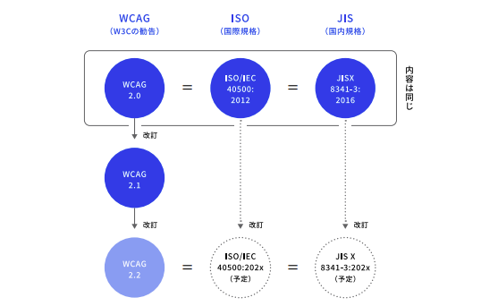

#

## JIS 規格に対応したウェブサイト

**対応度合い**
JIS X 8341-3:2016 の対応度を示す方法には、「準拠」「一部準拠」「配慮」の 3 つの方法がある。
**対応レベル**
レベル A（最も基本的なアクセシビリティ基準） < レベル AA
< レベル AAA（最も高いアクセシビリティ基準）

※レベル AAA に一部準拠と表記する場合にはレベル AA に準拠していること、レベル AA に一部準拠と表記する場合にはレベル A に準拠していることが前提。

#


# ウェブアクセシビリティで達成すべきこと

#

## 達成しないと利用者に重大な悪影響を及ぼすもの

「利用者がウェブページの他の部分へアクセスすることを妨げていない」→**非干渉**

#

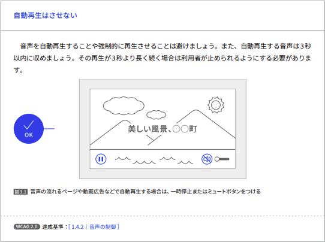

#

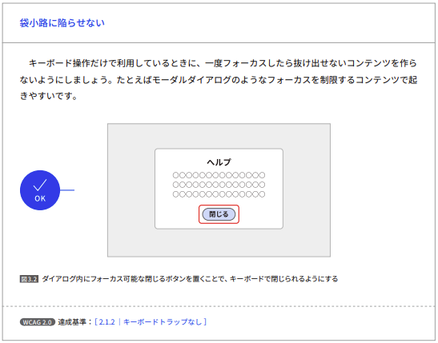

#

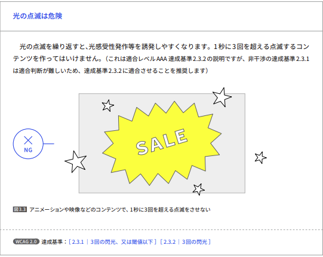

#

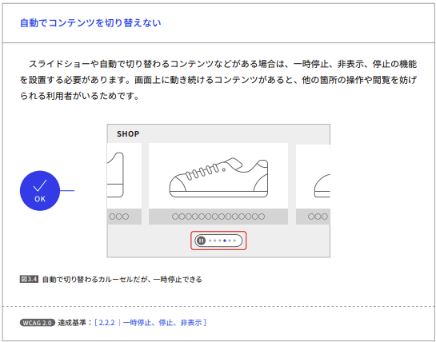

#

## 必ず達成しなければならないもの

優先して対応すべき項目

#

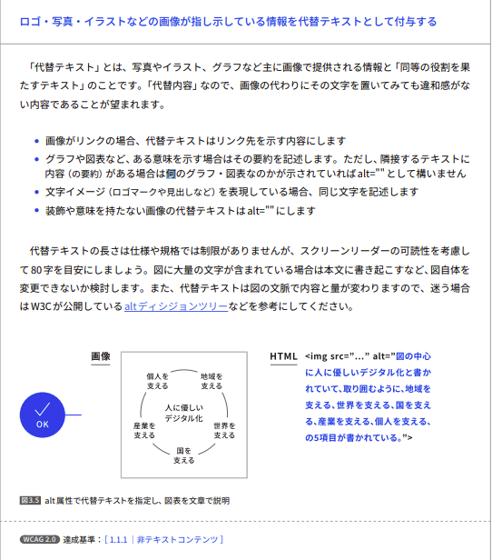

#

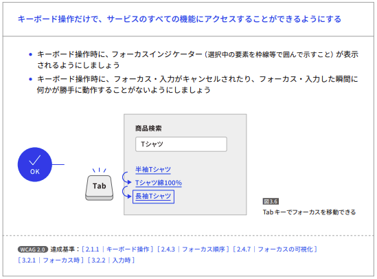

#

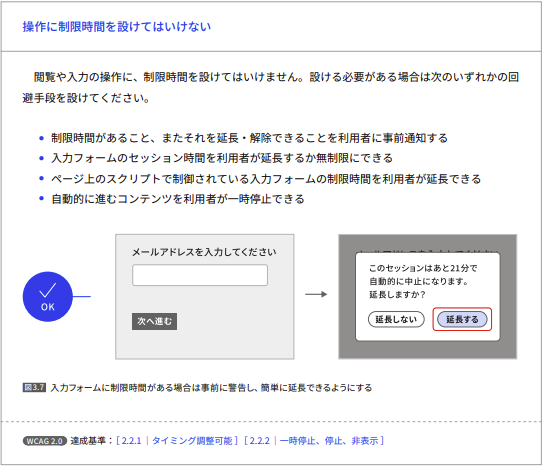

#


#

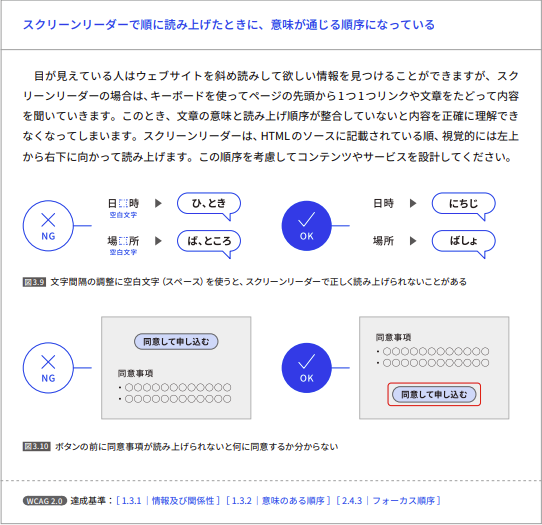

#

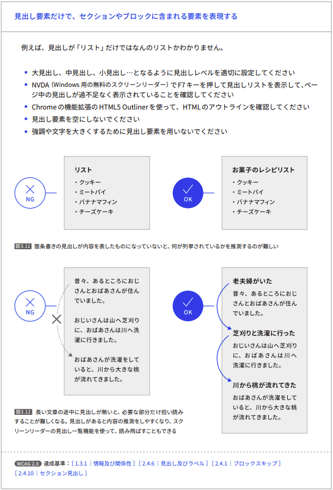

#

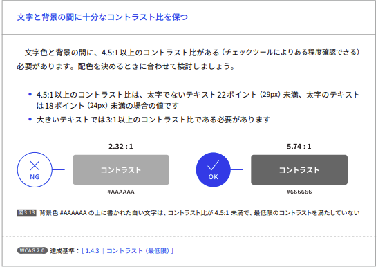

#


#

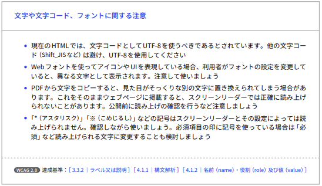

#

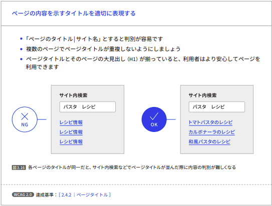

#

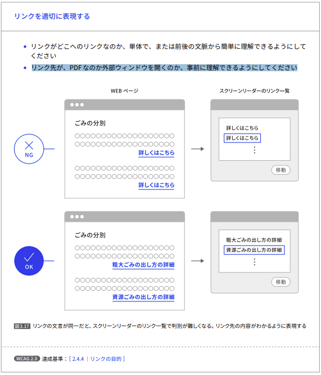

#

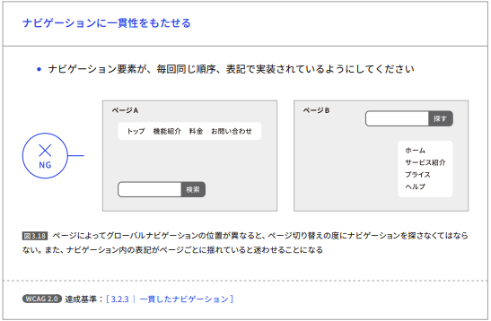

#

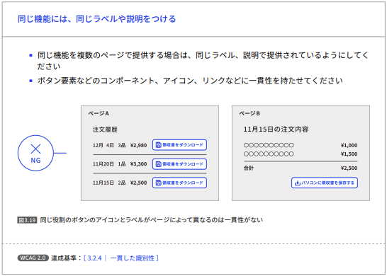

#

## 状況に応じて確認すべきこと

ウェブサイトや情報システムによっては無いこともあるコンテンツや確認事項。

#

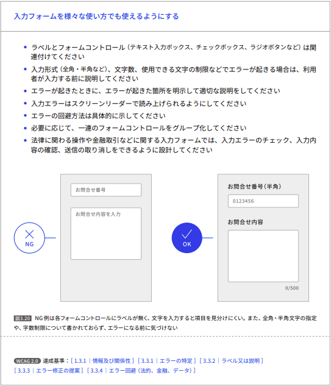

#

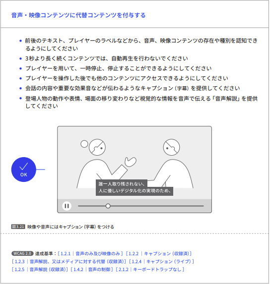

#

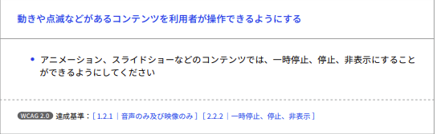

#

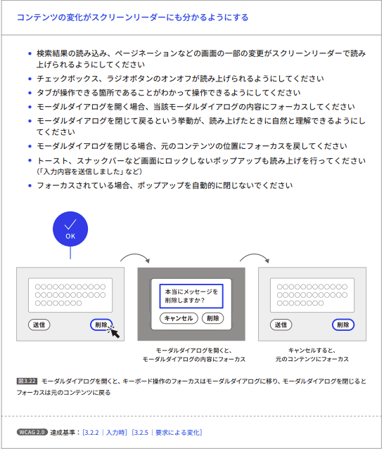

#

## 導入に慎重な検討が必要

使い方や使う場所によって、アクセシビリティを向上できなかったり、逆にアクセシビリティを損ねる技術や実装方法。それぞれの機能や効果をよく理解した上で導入。

#

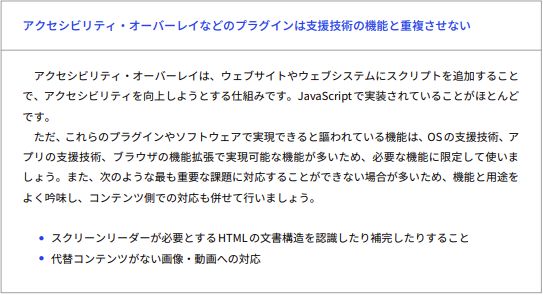

#

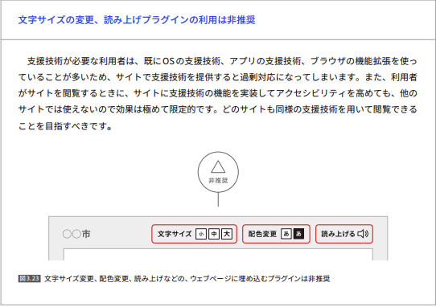

# ウェブアクセシビリティの実践プロセス

#

## 情報システムにおけるサービス開発

政府のシステム調達においては、JIS X 8341-3:2016 の AA 準拠を目標に決めるのが標準的な対応。
スマートフォン対応等を考慮にいれた場合には、WCAG 2.1 や 2.2 などのより新しい基準にも対応検討。

#

## WAI-ARIA(ウェイアリア)

Web Accesibility Initiative(作っている人)
Accessible Rich Internet Applications（仕様）

**WAI-ARIA はアクセシビリティを高めるため、マークアップ言語のアセマンティクスを補強するもの**

#

背景：アプリケーション化する Web

<hgroup><article><h1>などで表現できるタグと表現できないタグがある。タグをつくるのは大変なので、WAI-ARIAのような属性でセマンティクスさを補強する。

WAI-ARIA は HTML に限らない。マークアップ言語（XML SVG）も対象。

#

WAI-ARIA は、HTML に足りないセマンティクスさを補強できる。
役割：role
状態：aria-_
プロパティ：aria-_

```
<ul role="tree" aria-label="menu tree">
  <li role="treeitem" aria-selected="true">...</li>
  <li role="treeitem" aria-selected="true">...</li>
</ul>
```

#

これらの付与されたセマンティクスはどのようにユーザー（支援技術）に伝わるか。
↓
アクセシビリティ API（OS が支援技術にセマンティクスなどの情報を伝える API）を介して伝わる。

#

aria-label：可視ラベルが使用できない場所で不可視ラベルを提供できる。
「可視ラベルが使用できない」：ビジュアルを押した結果ラベルがない、不足しているコンテンツ
(ex)ハンバーガーメニューのアイコン、ヘッダー、フッターのメニュー
「不可視ラベルを提供」:スクリーンリーダーが読み上げることが出来る。

要は**ビジュアルではラベルなしのままで機械が読める代替テキストを設定できる**
ビジュアルにテキストはない方がイケてるが、ラベルを持たせたい

#

```
<!-- ハンバーガーメニューのアイコン -->
<button type="button" aria-label="サイトメニューを表示する">
  <span>...</span>
  <span>...</span>
  <span>...</span>
</button>
```

#

```
<!-- 同じ文言のリンク -->
<a href="~" aria-label="スポーツ情報について詳しく見る">more...</a>
<a href="~" aria-label="芸能情報について詳しく見る">more...</a>
<a href="~" aria-label="政治情報について詳しく見る">more...</a>
```

#

aria-labelledby
離れた要素のテキストをラベルとして使う

ラジオボタングループの近くにラベルとして使えそうな"泥酔するなら"という文言があるときにしようできる。

```
<p id="optionLabel">泥酔するなら</p>

<div role="radiogroup" aria-labelledby="optionLabel">
  <input type="radio" name="alcohol" value="~">ハイボール
  <input type="radio" name="alcohol" value="~">ストロングゼロ
  <input type="radio" name="alcohol" value="~">ビール
  <input type="radio" name="alcohol" value="~">ワイン
</div>
```

#

タブ：同じ表示領域で内容が切り替わるウィジェット

#

ライブリージョン：更新される領域であることを支援技術に伝える
