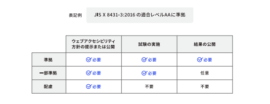
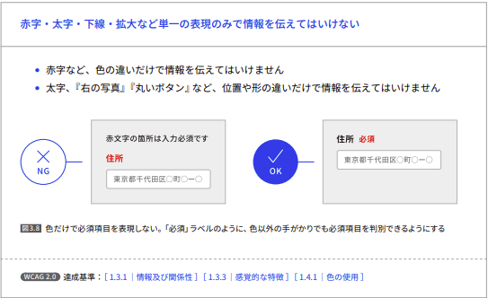
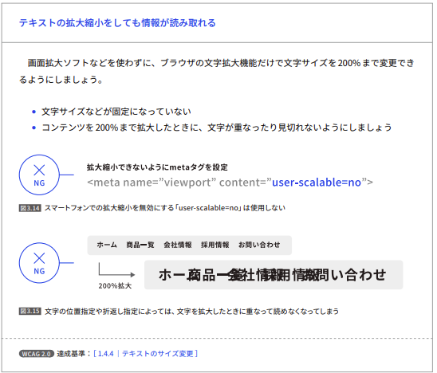

<!--
headingDivider: 1
-->

# _ウェブアクセシビリティ導入ガイドブック_

[参考資料](https://www.digital.go.jp/assets/contents/node/basic_page/field_ref_resources/08ed88e1-d622-43cb-900b-84957ab87826/53f76eaa/20240329_introduction_to_weba11y.pdf)

_永田佑斗_

#

**アクセシビリティ：情報へのアクセスのしやすさ**
ユーザビリティ：特定のユーザが特定の利用状況において、システム、製
品又はサービスを利用する際に、効果、効率及び満足を伴って特定の目標を達成する度合い

#

2024 年 4 月 1 日から改正障害者差別解消法が施行され、
事業者による障害者への合理的配慮が義務化。

ウェブアクセシビリティへの取り組みは、
合理的配慮を提供するための環境の整備として努力義務。

ウェブアクセシビリティの規格である JIS X 8341-3:2016
情報通信アクセス協議会ウェブアクセシビリティ基盤委員会（WAIC）
が公開している [「JIS X 8341-3:2016 試験実施ガイドライン」](https://waic.jp/docs/jis2016/test-guidelines/202012/)

# ウェブアクセシビリティの基礎

#

## ウェブアクセシビリティとは

**ウェブアクセシビリティが確保されている状態**

- 目が見えなくても情報が伝わる・操作できること
- キーボードだけで操作できること
- 一部の色が区別できなくても情報が欠けないこと
- 音声コンテンツや動画コンテンツでは、音声が聞こえなくても何を話しているかわかること

#

**ガイドラインと規格**

1. WCAG

2. JIS X 8341-3

ISO（International Organization for Standardization）は国際標準化機構
JIS（Japanese Industrial Standards）は日本産業規格 →JIS は ISO の内容を普及させる目的で制定されている。

#

## WCAG

W3C が作成しているガイドライン *Web Content Accessibility Guidelines*の略
1999 年に 1.0、2008 年に 2.0 が勧告され、現在は「2.2」
※2012 年に国際規格の ISO から、WCAG2.0 をそのまま採用した ISO/IEC 40500:2012 が発表。

WCAG 2.0 は、「知覚可能」「操作可能」「理解可能」「堅牢（robust）」の 4 つの原則と、ウェブアクセシビリティを向上させるための目標にあたる 12 のガイドラインで構成。ガイドラインを細分化した 61 の達成基準がある。

#

## JIS X 8341-3

正式名称：**高齢者・障害者等配慮設計指針－情報通信における機器，ソフトウェア及びサービス－第 3 部：ウェブコンテンツ**

2004 年に一般的なアクセシビリティの課題に加えて日本語固有の課題を解消するための要件が盛り込まれた JIS X 8341-3:2004 が発行。
2010 年に WCAG 2.0 の内容を取り込む形で大きく改定。
2016 年には WCAG 2.0 と ISO/IEC 40500:2012 と全く同一内容の一致規格として JIS X8341-3:2016 という規格に改定。

#

#

## JIS 規格に対応したウェブサイト

JIS X 8341-3:2016 の対応度を示す方法には、「準拠」「一部準拠」「配慮」の 3 つの方法がある。

#

# ウェブアクセシビリティで達成すべきこと

#

## 達成しないと利用者に重大な悪影響を及ぼすもの

「利用者がウェブページの他の部分へアクセスすることを妨げていない」→**非干渉**

#

#

#

#

#

## 必ず達成しなければならないもの

優先して対応すべき項目

#

#

#

#

#

#

#

#

#

#

#

#

#

#

## 状況に応じて確認すべきこと

ウェブサイトや情報システムによっては無いこともあるコンテンツや確認事項。

#

#

#

#

#

## 導入に慎重な検討が必要

使い方や使う場所によって、アクセシビリティを向上できなかったり、逆にアクセシビリティを損ねる技術や実装方法。それぞれの機能や効果をよく理解した上で導入。

#

#

# ウェブアクセシビリティの実践プロセス
