<!--
headingDivider: 1
-->

# _レンダリングの仕組みを完全に理解する_

_永田 佑斗_

#

参考文献
[Web ブラウザのレンダリングの仕組みを理解する](https://zenn.dev/oreo2990/articles/280d39a45c203e#discuss)
[ブラウザレンダリングの仕組みを理解し、Web サイトのパフォーマンス向上を目指す](https://noveltyinc.jp/media/browser-rendering)
[ブラウザレンダリングの仕組み](https://zenn.dev/ak/articles/c28fa3a9ba7edb)
[【俺的理解】ブラウザのレンダリングの仕組み](https://www.yukendev.com/blogs/oreteki-browser-rendering)

# 目的

Web ブラウザのレンダリングの仕組みを理解して、パフォーマンスの改善や Accessibility の向上に役立てる。

# レンダリング（演算処理）とは

指定したリソースをブラウザ画面に表示することをレンダリングという。
プログラミング言語はコンピュータが理解できる形へ変換され、普段目にする Web サイトとして表示されるフロー。

# レンダリングを実行するもの

Web ブラウザにある**Rendering engine**と**JavaScript engine**が相互的に行う。
Rendering engine は、HTML エンジンとも呼ばれ、HTML や CSS などの画面上で描画する際に動作するエンジン。
JavaScript engine は、ブラウザで JavaScript を実行するための環境を提供するソフトウェア。
※ブラウザごとに採用されているエンジンが異なる。
ブラウザ間で表示が異なるのは、レンダリングエンジンが異なるため。

#

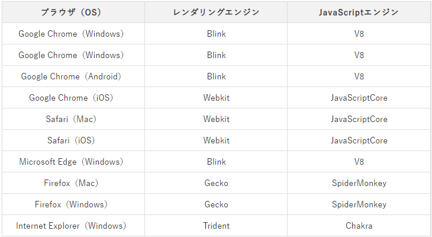

# レンダリングはスレッドという実行単位で行われる

#

スレッドとは、コードを実行できる機能のこと。

レンダリングの各フェイズは、いくつかのスレッドによって処理されている。
ブラウザレンダリングにおいて重要なスレッドは以下の 2 つ。

- Main Thread（メインスレッド）
  Paint の一部までの処理や javascript の実行など、レンダリング工程において大部分の処理を担う。CPU で行われる。
- Compositor Thread（コンポジタースレッド）
  主に Rasterize と Composite 処理を担う、GPU で行われる。

※汎用性: CPU は汎用的な処理、GPU は特定の計算（並列処理やグラフィックス）に特化。
**Main Thread への負荷をなるべく軽減し、Compositor Thread による処理範囲で変更を行うことは、パフォーマンス向上の観点で非常に重要**

# レンダリングの仕組み

#

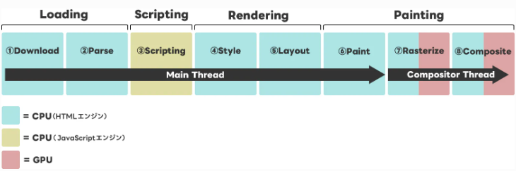

#

## 1. Download

サーバーからデータをダウンロード。
表示するために必要な HTML ファイル、CSS ファイル、JavaScript ファイル、画像・動画ファイル
まず、HTML ファイルをダウンロードし、必要に応じて再起的によびだす。

#

## 2. Parse

①DOM Tree 構築
②CSSOM Tree 構築
③JavaScript の実行
サーバーから送られてきた HTML ファイルは Byte データなので、そのままの形で解釈し表現することはできない。
HTML は DOM Tree、CSS は CSSOM Tree という、ブラウザ自身が扱うことができる形に変換する作業を行う。

変換のステップは以下の図

#

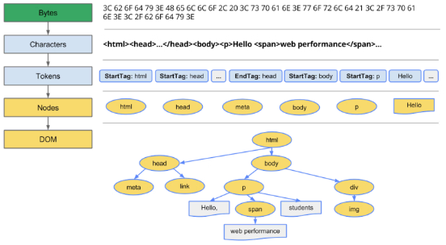

#

### 1.1Conversion(Bytes→Characters に変換)

取得したバイトデータを Response Headers の Content-Type の文字コードに基づいて文字列変換

※両方ないときは、バイトデータから推測して文字コードが自動判定
※Content-Type がないときは、HTML の meta タグを参照
※Content-Type と meta タグの両方があるときは、Contents-Type を優先

#

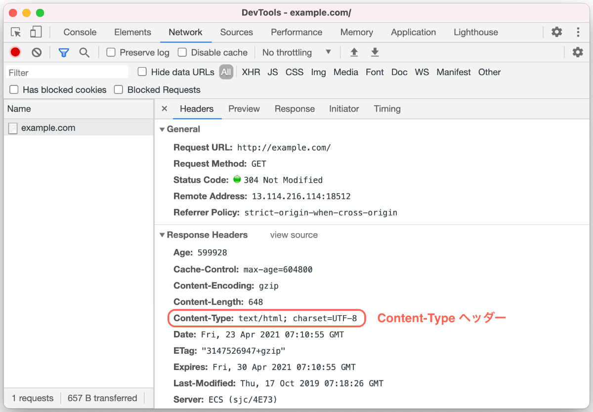

#

### 1.2Tokenizing(Characters→Tokens に変換)

Characters が HTML 形式でマークアップされたただの**テキスト**を W3C HTML5 standard で規定されている規則に基づいて<html>や<body>などの意味を持つ 1 つの文字の塊、すなわちトークンに切り分けられ、並べる。
イメージ：文章を単語に区切る

- Start Tag <html> <h2>
- End Tag </html> </h2>
- Character 大阪　 melon
- DOCTYPE
- Comment <!--〇〇-->
- EOF ( End-Of-File / ファイルの終わり )

#

### 1.3Lexing(Tokens→Nodes)

トークンからノードに変換する。
分かりやすく言うと、トークン（ただのテキスト）からノード（性質をもつオブジェクト）に変換する。
HTML 文書はツリー構造にしていくので、ツリーを構成するためにノードというオブジェクトに変換する。

#

オブジェクトとは、プロパティとルールを定義する実体。
ノードがどのようなプロパティ、メソッドを持つのかは、以下の Node インターフェースの定義
[DOM Living Standard](https://triple-underscore.github.io/DOM4-ja.html#interface-node)

```
interface Node : EventTarget {
   //...省略
  [CEReactions] Node appendChild(Node node);
  [CEReactions] Node replaceChild(Node node, Node child);
  [CEReactions] Node removeChild(Node child);
};
```

appendChild や replaceChild や removeChild というメソッドが定義されている。

**ノードはオブジェクトであり、オブジェクトを作るのに必要なプロパティやメソッドは Node というインターフェイスで定義されている**

#

[MDN](https://developer.mozilla.org/en-US/docs/Web/API/Element)

> 親インターフェスである Node、およびその親インターフェイスである EventTarget からプロパティを継承します。

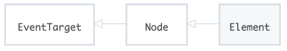
ノードの種類は全部で 12 種類あり、要素や要素の属性、要素内のテキスト等もノードになる。

#

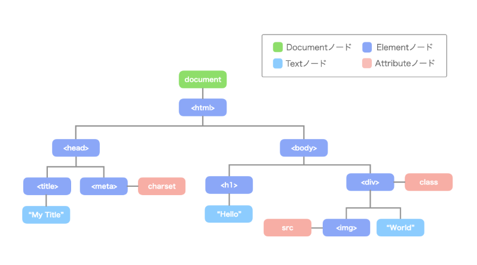

#

### 1.4DOM construction(Nodes→DOM)

HTML データに基づいて作成された各 Node は、親子関係を持っているので、それらを元にツリー状のデータである DOM (DOM Tree)を構築する。

**DOM:HTML 文書をツリー状のデータ構造として扱い、それをプログラムから参照したり操作したりするためのデータ構造やインタフェース ( API ) を定義したもの**

#

#### DOM が生まれた背景

1990 年代前半、Web が最初に開始されたとき、世界には静的な Web ページしかなかった。
それでは表現できることが非常に限られていたので、次第に動的なコンテンツを配信したいという要求が高まる。
そんな中で開発されたのが DynamicHTML と呼ばれる。DHTML の中心的な技術が DOM API と JavaScript（ 当時は「LiveScript」）。

※DOM (Document Object Model) は API の一種です。具体的には、DOM は Web ブラウザが HTML や XML 文書を解析した結果として作成する階層構造を表すものであり、その構造にアクセスして操作するための API。

#

```javascript
const p = document.querySelector("p");
p.textContent = "updated Text!";
```

textContent というメソッドは、「ノードとはオブジェクトである」で登場した Node インターフェイスで定義されているメソッド。
トークンからノードに変換するときに、こういったノードを操作するのに便利なメソッドやプロパティが一式装備されるイメージ。

#

### 2 CSSOM construction

DOM Tree が構築されているときに、CSS ファイルへの参照があると、CSS データを CSSOM（CSS Object Model）に変換する。DOM Tree で説明したものとほぼ同じ流れで変換される。


#

**特長**

1. CSSOM Tree では、cascade down(カスケードダウン)と呼ばれるルールが適用される。cascade down では、親ノードの設定を子ノードが継承し、子ノードで親ノードと同じ設定があると上書きされる。
2. 各 Web ブラウザでは、user agent stylesheet と呼ばれるデフォルトのスタイルを提供しています。作成した CSS は、この user agent stylesheet を継承する形になる。
   ※Cascade：何段も連なった小さな滝

CSSOM のイメージ（下の図）
※<meta> や <script> や <title> などのページに表示されない DOM 要素は CSSOM には含まれない

#

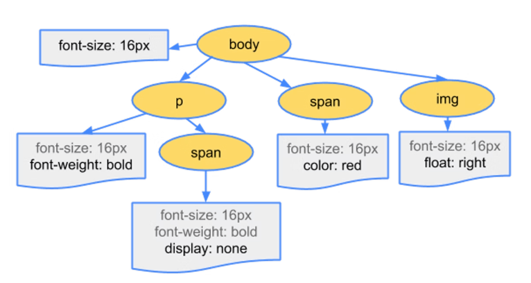

#

## 3.Scripting

### JavaScript Execution

Web ブラウザが、DOM Tree を構築しているときに、JavaScript の参照(また JavaScript の記述)があると、DOM Tree 構築が中断され、JavaScript コードに則って、DOM や CSSOM に変更処理が加えられる。変更処理が終了すると、DOM Tree 構築が再開する。

DOM Tree 構築を中断させる処理のことを _Parser blocking_ といい、処理が重くなる原因でもある。

#

プログラマが書いたプログラム ( ソースコード ) は、作成段階ではただのテキストファイルなので、コンピュータの頭脳である CPU がソースコードを理解するためには、機械語に変換する必要がある。

#

プログラマが書いたプログラム ( ソースコード ) は、作成段階ではただのテキストファイルなので、コンピュータの頭脳である CPU がソースコードを理解するためには、機械語に変換する必要がある。

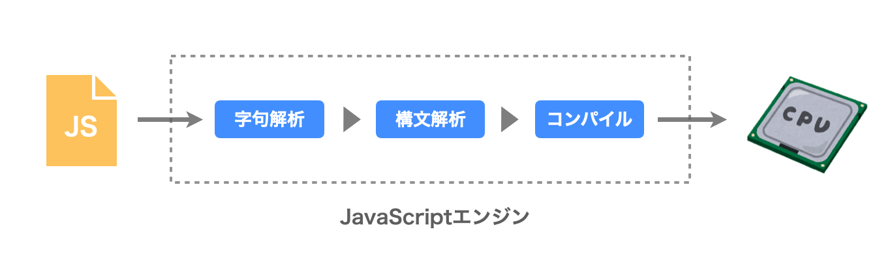

#

### 3.1 字句解析

JavaScript エンジンは、ソースコードの文字列を一文字ずつ読んでいって、トークンと呼ばれるプログラム的に意味のある文字列の最小単位に切り分ける。
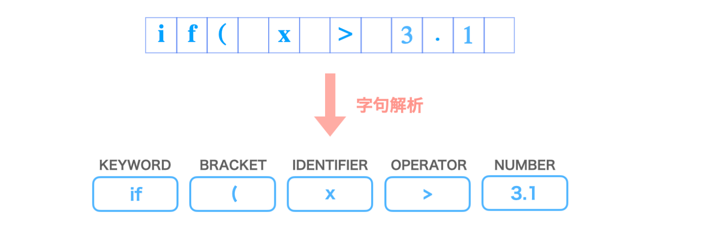

#

### 3.2 構文解析

字句解析で得たトークンの配列から抽象構文木 ( Abstract Syntax Tree ) を作成する。
AST は JavaScript の DOM。
< や > などのタグを表す文字が DOM で保持されなかったように、AST では言語の意味に関係ない ( などの情報は取り除かれます。そして、意味に関係ある情報のみを取り出した ( 抽象した ) ツリー構造のデータになります。
JavaScript の場合、AST は JavaScript オブジェクト ( JSON )

#

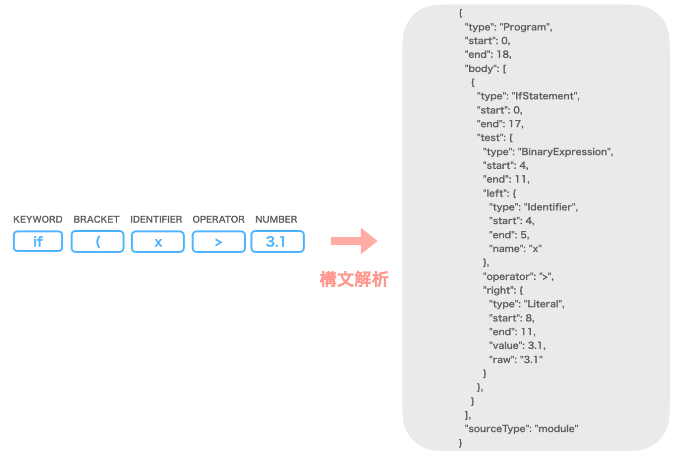

#

### 3.3 コンパイル

構文解析で得られて抽象構文木をコンパイルして機械（CPU）が解釈できる 01 の羅列の機械語に変換する。
一般的に、機械語に翻訳する方法は 2 つある。

#

1. インタープリタ

インタープリタでは、実行時にソースコードの内容を一行ずつ解釈して処理していきます。ソースコードを即座に実行開始できるため、開発や修正をテンポよく進めることができます。しかし、同じコードを何度も実行するようなループ ( 繰り返し ) の箇所などでは、一度構文解釈した部分でも毎回最初から解釈と実行を行うので、実行速度が遅くなるという欠点があります。

#

2. コンパイル

呼ばれる方式は実行速度が速いのが長所。
実行前にソースコード全体を解釈して処理するので、ループのときに毎回翻訳を繰り返すということはない。またコンパイラでは、「最適化」と呼ばれるコードの中身を確認して、より速く動作するよう編集を行うことも可能。( インタープリタは実行時に作業を行っているため、時間がなくてこの最適化ができない。)
コンパイラの欠点としては、ソースコードの修正から実行までにコンパイルの時間を要するため、開発時などでは作業性が悪いという点があります。
ビルドはコンパイルとリンクを行う作業のこと。
※リンクはそれらの翻訳後のファイルを適切に組み合わせること。

#

初期の JavaScript エンジンのほとんどは、インタプリタで実装されていました。
しかし近年では「JIT コンパイラ」というコンパイラで実装していることが多いです。Google Chrome の V8 や、Safari の Nitro でこの JIT コンパイラを利用しています。

JIT コンパイラは、簡単にいうと上記 2 つのいいとこ取りをしたようなコンパイラです。
機械語に一気に変換するのでなく、中間言語に変換したあとに一行ずつコンパイルして実行します。中間言語のファイルを作ることで OS や CPU に依存しない環境で実行でき、インタプリタ形式よりも実行速度が早くなります。JIT とは Just In Time の略で、ちょうど間に合う ( その都度 ) というような意味を持つ。

#

最終的に機械語に変換された JavaScript コードは CPU で実行される

#

### 余談:ビルド(コンパイルとリンク)が必要なコードと不必要なコード

#

## ビルド必要

ソースコードから実行可能な形式に変換する必要があるコード。

コンパイル言語：**C,C++,Java, TypeScript** はソースコードをコンパイラでコンパイルして実行可能なバイナリや中間コードに変換する必要がある。

- バンドラー:モジュールやファイルをまとめる。依存関係を解決し、最終的な出力ファイルを生成します。Webpack、Parcel、Rollup
- コンパイラー:ソースコードを機械語や中間コードに変換します。実行可能な形式にするためのツールです。 GCC (C/C++)、javac (Java)、TypeScript Compiler (tsc)
- トランスパイラ:ソースコードを異なるバージョンのコードに変換します。同じレベルの抽象度で変換を行います。 Babel (ES6+から ES5 へ)、TypeScript (TypeScript から JavaScript へ)

#

## ビルド不必要

ソースコードをそのままブラウザや実行環境で直接実行できるコード。

スクリプト言語: JavaScript、HTML、CSS など、ブラウザやインタプリタが直接解釈して実行できる言語
インタプリタ言語: Python、Ruby などの言語も、通常は直接実行できるため、ビルドが不要。

#

## 4.Style

前工程で構築された DOM ツリーと CSSOM ツリーを結合し、どのスタイルをどの要素に当てるかを計算する処理を行う。どのノードにどのようなスタイルが当たるのかを詳細度をもとに計算し、この処理によって結合されたツリーは Render Tree と呼ぶ。Render Tree は、ブラウザ画面に表示される Node だけで構築される。
※display: none が設定されている span オブジェクトや、ブラウザ画面に表示されない head オブジェクトなどは、Render Tree から除外される

#

### 前提知識

スタイル情報は、フォント、色、背景、ボーダーなど、見た目に関する設定を定義します。
レイアウト情報は、要素の配置、サイズ、位置など、要素のレイアウトや構造に関する設定を定義します。

#

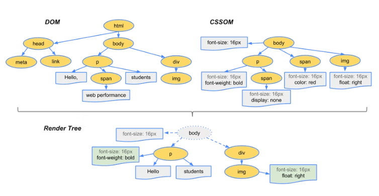

#

**Render blocking**

Render Tree は DOM Tree の構築と CSSOM Tree の構築が終わり次第開始する。
CSS ファイルが大きく CSSOM Tree の構築に時間がかかる場合は、Render Tree の構築に時間がかかる。このようにレンダリングが遅れることを Render blocking と呼ぶ。

#

## 5.Layout

Render Tree の構築後に、各 Node の viewport 上でのサイズと位置を算出する。
この工程は、ツリーの上流から下流にかけて再帰的に行われる。
下記では、body タグ配下の div タグでは、表示サイズを viewport の 50%とし、さらにその配下の div タグでは、表示サイズを viewport の 25%(=0.5 × 0.5 × 100)とします。

#

```html
<!DOCTYPE html>
<html>
  <head>
    <meta name="viewport" content="width=device-width,initial-scale=1" />
    <title>Critial Path: Hello world!</title>
  </head>
  <body>
    <div style="width: 50%">
      <div style="width: 50%">Hello world!</div>
    </div>
  </body>
</html>
```

#

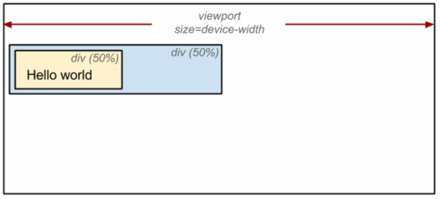

#

このフェイズの終了後、アニメーションなどによって親要素の Layout に関わるプロパティに変更が加わると、その子要素にもこの ⑤Layout（レイアウト）以降の処理が再び走ることになってしまい、処理の負荷がかかってしまう。

#

## 6.painting

描画コマンドの生成 と Rasterize, Composite

#

## 6.1 描画コマンドの生成（「Paint Records」と呼ばれるものを作成）

これまでの工程で確定された内容をもとに、実際に描画を行います。厳密には、まず要素同士の重なり（z-index）が計算されたあとに行われる。

ブラウザは内部に画面にピクセルを描画するためにグラフィックエンジンと呼ばれるソフトウェアを内蔵しています。
このフェーズでは、このグラフィックエンジンに向けた『〇〇を描画しろ！』という命令を生成する。
ここまでの処理を終えると、ようやく Main Thread は解放され、以降の処理は Compositor Thread へ引き渡される。

#

## 6.2 Rasterize

ラスター：データを「座標」と「色」の 2 つで構成されている形式
ベクター：直線や曲線などを数式として扱っている形式

実際にピクセルとして描画していきます。この処理フェイズを Rasterize と呼びます。

また、モダンブラウザでは、Layer Tree という構造体の生成も Rastarize フェイズで同時に行われます。Layer ツリーを生成する目的は、ある要素に変更があった場合、Layout（レイアウト）フェイズでも解説したように、本来であればそれ以外の要素への影響を考慮し多くの計算を行い直さなければならないところを、要素の情報をレイヤーとして保持しておくことで、その計算処理を最低限に抑え、軽量化させる目的がある。

#

レイヤーは次のような条件がある際に複数生成されます。

要素が position: abusolute なスタイルプロパティが適用されている
要素が position: fixed なスタイルプロパティが適用されている
要素が transform: translate(0px, 0px, 0px)などの GPU で描画、合成される CSS プロパティを持っている
要素に opacityCSS プロパティが適用されており、透過して背後のコンテンツが表示される必要がある。

#

## 6.3 Composite（コンポジット）

※モダンブラウザだけのフェーズ
Composite:複合

ピクセル描画された Layer ツリーを合成（レイヤーの合）し、画面上に表示します。この処理フェイズを Composite とよぶ。

#

**Paint の変遷**

#

1. ユーザーが画面をスクロールしたときにフレームを移動させて、さらに Rasterize をして不足している部分を埋めていくというようなシンプルな方法

#

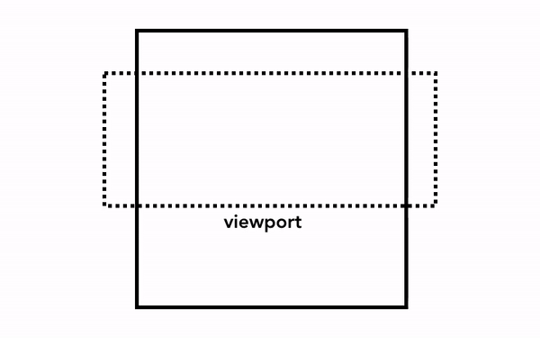

#

2. ページをいくつかの層 ( レイヤー ) に分けて、ピクセルを塗りつぶす作業を別々に行って、最終的 に 1 つのページとして組み合わせる手法。

ユーザーが画面をスクロールしたときには、レイヤーはすでにピクセルとして描かれているため、新しいフレームを合成するだけで済みます。

また、再レンダリングの際にも、変更があったレイヤーのみ再計算すれば済むので、計算量を大幅に削減することができます。

#

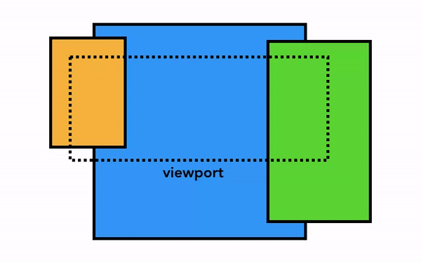

#

レンダリングの全体像

#

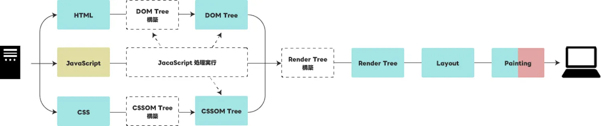
