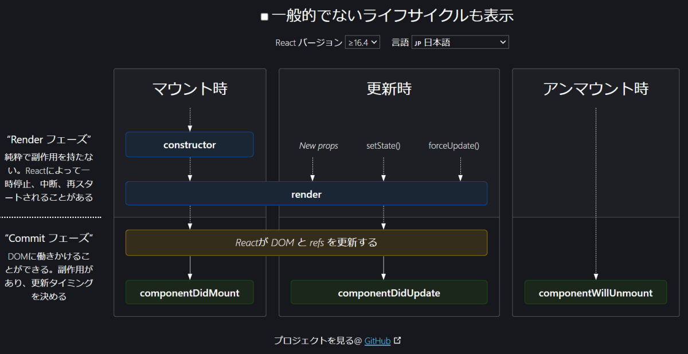
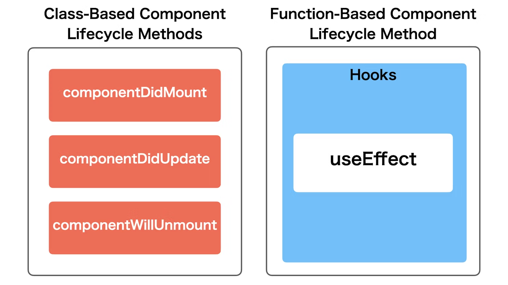
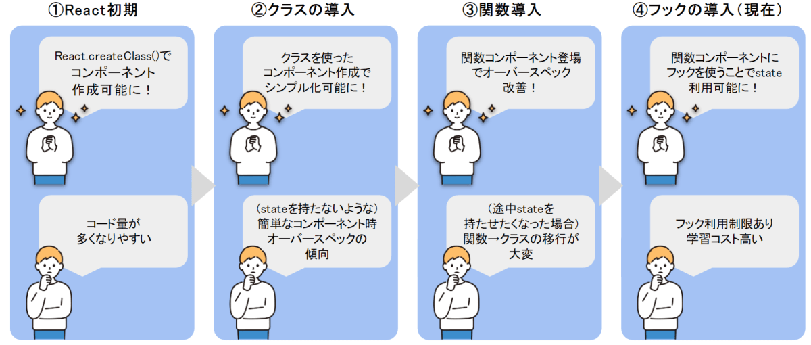

<!--
headingDivider: 1
-->

# _REACT コンポーネントのライフサイクル_

_永田 佑斗_

# 参考文献

[React を学ぶ](https://ja.react.dev/learn/)
[React hooks を基礎から理解する (useState 編)](https://qiita.com/seira/items/f063e262b1d57d7e78b4)
[Hooks 時代の React ライフサイクル完全理解への道](https://zenn.dev/yodaka/articles/7c3dca006eba7d)
[React hooks が何故うれしいのか、React の今までを含めて解説](https://qiita.com/_muraham/items/d31628e15ed6ff6e3f58)
[React のレンダリングを理解する](https://zenn.dev/1129_tametame/articles/bf4fc2005bea4d)
[【イラストで分かる】React とライフサイクル](https://zenn.dev/koya_tech/articles/16d8b11b5062bd)
[React を関数型プログラミングの文脈で理解する](https://zenn.dev/tockri/books/dcaf6c55e64448/viewer/react)

# 目的

クラスコンポーネントと関数コンポーネントの特徴を理解し、それぞれのライフサイクルを完全に理解する。

変遷
**クラスコンポーネント → 関数コンポーネント × Hooks**

# 前提知識

#

**React が定義するレンダリング**

[React Docs](https://react.dev/learn/render-and-commit#step-2-react-renders-your-components)

> “Rendering” is React calling your components.

React がコンポーネントを呼び出し、DOM に反映させるための情報を読み込むことを指す。

≠ ブラウザレンダリング（DOM を作成し、画面に描画すること）

#

**JSX がブラウザレンダリングされるまで**

#

1. JSX を記述
   JSX とは、js の拡張言語で、HTML に似た構造。
   **実際のブラウザで動かない**

```jsx
const element = <h1>Hello, world!</h1>;
```

#

2. Babel などによるトランスパイル:
   JSX をブラウザが直接解釈できる通常の js に変換

```js
const element = React.createElement("h1", null, "Hello, world!");
```

#

3. Webpack などのバンドルツールによるパッケージング
   JSX コードと依存関係をひとまとめにして、ブラウザで実行できる単一の JavaScript ファイル
   ※ビルドのタイミングでバンドルされる。
   ビルドには、トランスパイルや最適化が含まれる。

#

4. React が仮想 DOM を生成
   **ここからマウント時、更新時の処理**
   変換された JavaScript がブラウザ上で実行される（マウント時）
   or 状態が更新されると（更新時）と、
   React.createElement()が呼び出され、React は仮想 DOM（Virtual DOM）を生成。

#

5. 差分検知
   生成された新しい仮想 DOM を、前回の仮想 DOM と比較

#

6. 仮想 DOM と実際の DOM の同期
   React の render()メソッドが差分が検出された部分だけ をリアル DOM に反映
   ```js
   ReactDOM.render(element, document.getElementById("root"));
   ```
   それ以降は、通常の HTML と CSS が描画されるのと同様、
   レンダーツリー（DOM CSSOM の合体）を作成し、レンダーツリーを基にレイアウト、painting

#

副作用とは、関数や処理がその本来の目的以外に外部に影響を及ぼすこと。

# 本題

# React のライフサイクルとは

**コンポーネントの誕生から消滅までに発生する一連のイベント**

- Mounting—>コンポーネントの誕生

- Update—>コンポーネントの更新

- Unmount—>コンポーネントの削除

# クラスコンポーネントについて

#

## Lifecycle メソッド

3 つのライフサイクルごとに呼ばれるメソッドがある。

呼び出し順・太字は重要

#

- Mounting
  初期表示

1. **constructor()**
   クラスがインスタンス化される時に呼ばれる。
2. static getDerivedStateFromProps()
3. **render()**
   ブラウザに DOM を表示する、もしくは DOM に描画済みのデータを更新
4. **componentDidMount()**
   **マウント時**に、DOM が描画された後に実行。副作用で使用。（DOM にアクセスする必要のない API リクエストなど、）

#

- Updating
  状態変化による更新

1. static getDerivedStateFromProps()
2. shouldComponentUpdate()
3. **render()**
4. getSnapshotBeforeUpdate()
5. **componentDidUpdate()**
   副作用で使用。 **更新時に**、DOM が描画された後に実行

#

- Unmounting
  コンポーネントが DOM から削除

1. **componentWillUnmount()**
   副作用で使用。**コンポーネントが破棄される前**に呼ばれる。

#

**以下の図は、クラスコンポーネントで用いられる図**
関数コンポーネントではないので注意。

#



#

```jsx
class MyComponent extends React.Component {
  constructor(props) {
    super(props);
    this.state = { data: null };
  }

  componentDidMount() {
    // コンポーネントがマウントされたときにデータを取得
    fetch("/api/data")
      .then((response) => response.json())
      .then((data) => this.setState({ data }));
  }

  componentDidUpdate(prevProps, prevState) {
    // プロパティや状態が更新されたときの処理
    if (prevProps.someProp !== this.props.someProp) {
      // 例: プロパティが変わったときの処理
    }
  }

  componentWillUnmount() {
    // コンポーネントがアンマウントされるときのクリーンアップ
    // 例: サブスクリプションの解除やタイマーのクリア
  }

  render() {
    const { data } = this.state;
    return <div>{data ? <p>データ: {data}</p> : <p>読み込み中...</p>}</div>;
  }
}
```

#

1 つのクラスで各ライフサイクルメソッド内に処理を定義する。

#

## クラスコンポーネントの遷移

1. React.createClass を使った、React 初期の Component の定義
   当時 Class 構文に対応した javascript がまだ正式にリリースされてなかったため、React.createClass() で Class 構文を使わず Component を作成するメソッドが用意された。

   コードが長くなる理由、オブジェクトのプロパティにライフサイクルメソッドやステートの初期化、イベントハンドラのバインディング、ミックスインの使用などが複雑に絡むためです

#

```jsx
import React from "react";
import ReactDOM from "react-dom";

//React.createClass を使った、React 初期の Component の定義
const MyComponent = React.createClass({
  getInitialState() {
    return { count: 0 };
  },

  render() {
    return (
      <div>
        <p>Count: {this.state.count}</p>
      </div>
    );
  },
});

export default MyComponent;
```

#

2. React.Component を継承した ClassBased なコンポーネントの定義（React16 以降）
   js でクラス構文がリリースされた
   ① の方法では、コード量が多くなりやすい。
   長大なオブジェクトの定義でカンマのつけ忘れなどで syntax error を起こしてしまうも多くあったのもあり、使用されなくなった。
   そのため、現在のクラス（の基礎）による記述方法が生まれた。
   ライフサイクルメソッドをクラスのメソッドで定義。

#

```jsx
import React, { Component } from "react";

//React.Component を継承した ClassBased なコンポーネントの定義
class MyComponent extends Component {
  constructor(props) {
    super(props);
    this.state = { count: 0 };
  }

  render() {
    return (
      <div>
        <p>Count: {this.state.count}</p>
      </div>
    );
  }
}

export default MyComponent;
```

# オブジェクト指向のクラスコンポーネントの Pros&Cons

Pros:

1. ライフサイクルメソッドの利用
   componentDidMount、componentDidUpdate、componentWillUnmount など、コンポーネントのライフサイクルに基づく処理を実装しやすい
2. クラスの機能を利用
   this キーワードを使って、状態やメソッドを管理するのが直感的
3. 状態管理の明確化
   状態 (state) を持つため、コンポーネント内での状態管理が比較的分かりやすい

#

Cons:

1. ボイラープレートコードの多さ(実装に必要なコード量が多い)
   小さいコンポーネントであっても、比較的多くのボイラープレートコードが必要
2. ステートとライフサイクルの管理の複雑さ
3. フックに比べて柔軟性に欠ける
   React のフック (useState や useEffect など) の登場により、関数コンポーネントの方がよりシンプルで再利用性が高い
4. オーバースペック
   State すら持たない、ただ render() したいだけの Component など、通常の Class による定義がオーバースペックになる場合がある。

# オブジェクト指向プログラミング（OOP）から関数型プログラミング（FP）へ

- OOP はデータとそれに関連するメソッド（振る舞い）をまとめ、オブジェクトとして扱います。状態を管理する必要があり、状態の変化を中心にプログラムを組み立てます。
- FP は状態を持たず、副作用を避け、関数によるデータ変換を重視します。関数型プログラミングは、不変性と純粋性を中心に、コードの簡潔さと安全性を確保します。

#

もともと関数コンポーネントは存在していたが、状態管理ができなかったため、クラスコンポーネントを利用していた。しかし、React 16.8 で **フック（Hooks）** が導入されたことで、関数コンポーネントへの移行を加速された。フックとは、関数コンポーネントでも状態管理(useState)や副作用の処理(useEffect)を可能にするツール。ライフサイクルメソッドの代替。オブジェクト指向ではないので、ライフサイクルフックと呼ぶべきか。。。

# 関数コンポーネントについて

**関数コンポーネントはオブジェクトではない**

関数コンポーネントは、クラスコンポーネントとは異なり、JavaScript の関数として定義。

#

公式ドキュメントにも、関数コンポーネントのライフサイクルの記載はない。
**関数コンポーネントにおいて、ライフサイクルフックの概念は存在しない。**
また、関数コンポーネントの場合「レンダリング」は、「関数コンポーネントが実行されること」を指していることが多い。

#

クラスコンポーネントの constructor()はインスタンス生成のことを指すので、オブジェクト指向ではない関数型コンポーネントでは存在しない。その代わり、関数型コンポーネントでは、マウント、更新の度に関数コンポーネントに書かれた全てが実行される。そのため、**マウント時で呼ばれ、更新で呼ぶ必要のない重い処理があるときは、useCallback や useMemo を使っての最適化する必要がある。**

# useMemo(),useCallback()

useMemo()：メモリを持ち、関数によってメモ化された値を返すフック。
useCallback()：メモ化されたコールバック関数を返します。メモ化とは同じ入力が再度発生した時に、キャッシュした結果を返す
※メモ化とは、関数の呼び出しで同じ入力が再度発生した時に、キャッシュした結果を返すこと。

# 副作用

useEffect が引数によって、componentDidMount(),componentDidUpdate(),componentDidUnmount()の働きをする

#



#

- useEffect は関数コンポーネントでライフサイクルメソッドを持たせるための機能
- クラスコンポーネントで利用していたライフサイクルメソッドを一つの関数で表現できる
- 記述の仕方で実行タイミングが変わる

#

componentDidMount()のように初回レンダリングのときだけ

```jsx
import React, { useEffect } from 'react';

const App = () => {
  useEffect(() => {
    // 処理
  }, []);  // 第二引数の配列を空にする

  return (
    // JSX
  );
};

```

#

レンダリングされるタイミングで毎回実行

```jsx
import React, { useEffect } from 'react';

const App = () => {
  useEffect(() => {
    // 処理
  });  // 第二引数を省略

  return (
    // JSX
  );
};

```

#

任意の変数が変化したときのみ実行する

```jsx
import React, { useState, useEffect } from "react";

const Counter = () => {
  const [count, setCount] = useState(0);

  useEffect(() => {
    console.log("useEffect!!");
  }, [count]); // 第二引数の配列に任意の変数を指定（ここではcountが変化した時のみ実行されるようにしている）

  return (
    <div>
      {count}
      <button onClick={() => setCount((prevCount) => prevCount + 1)}>
        ADD 1
      </button>
    </div>
  );
};
```

# ライフサイクルフックイメージ

ひとまず、以下のように定義

```jsx
function Example() {
  // 「initialize」

  useEffect(() => {
    // 「effect」

    return () => {
      // 「removeEffect」
    };
  });

  // 「render」
  return <></>;
}
```

#

initialize
setState やメソッドの定義、つまり初期化を行う。
この時点で DOM は描画されていないと思いきや、更新時は描画されていることがある。
が、それはすでに React の手を離れた描画済みのものであり、ここで DOM を参照することはできない。（はず）
副作用は必ず useEffect を使う。

render
ブラウザに DOM を表示する。
もしくは DOM に描画済みのデータを更新する。

#

effect
副作用を起こす。
ただし、依存配列が指定されている場合はそれによって実行されるかされないかが変わる。
componentDidMount と componentDidUpdate が一緒になった的な位置付けだが厳密には違う。

removeEffect
副作用のクリーンアップがされる。
ただし、依存配列が指定されている場合はそれによって実行されるかされないかが変わる。
componentWillUnmount 的な位置付けだが厳密には違う。

# 順番

- マウント

1. initialize

2. render

3. effect

#

- 更新

1. initialize

2. render

3. removeEffect

4. effect

ここで驚いた人もいると思うが、なんと useEffect のクリーンアップ関数はアンマウント時だけではなく、更新時の effect が呼ばれる前にも呼ばれる。ただし、マウント時には呼ばれない。

#

- アンマウント

1. removeEffect

# React の技術遷移

# 特徴

- constructor はマウント時にしか呼ばれないが、initialize は更新時にも呼ばれる
- componentWillUnmount はアンマウント時にしか呼ばれないが、removeEffect は更新時に effect が実行されるならその前に呼ばれる

#



# React のバージョン変遷

React.createClass（クラスコンポーネント）
↓
LifeCycle メソッド追加
↓
React.Component（クラスコンポーネント）
↓
関数コンポーネント
状態管理が必要なときは、クラスコンポーネントを持つ
↓
フック（Hooks）の導入（React 16.8）
関数コンポーネントでも状態管理やライフサイクルメソッドと同等の機能を持つようになる。
↓
今：React 18.3
