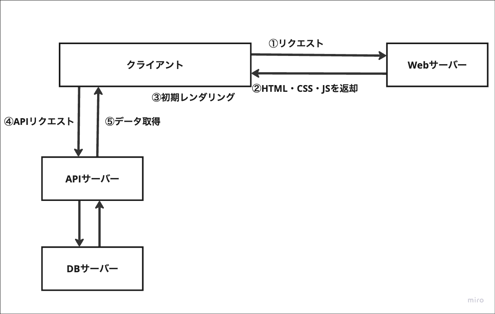
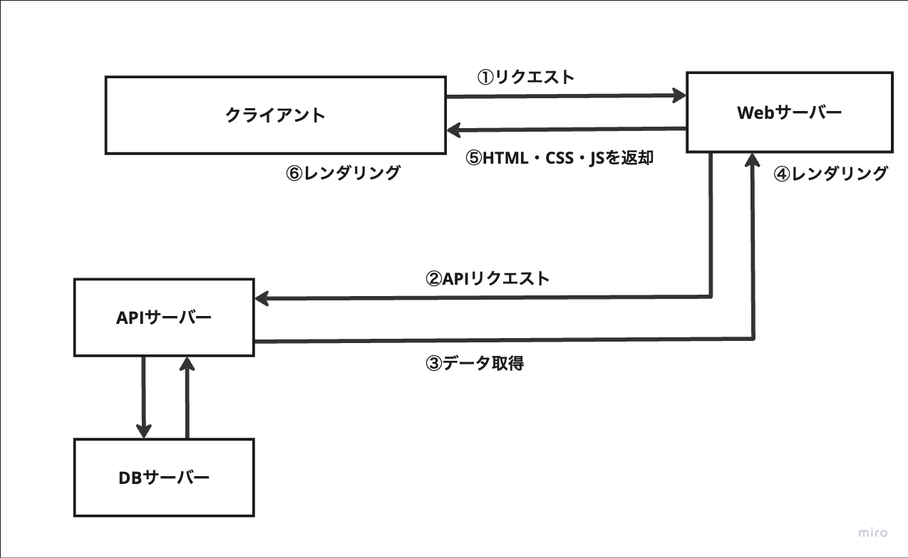
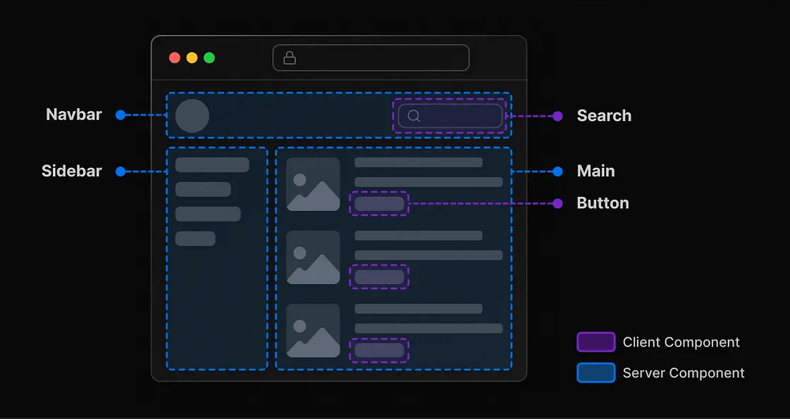

<!--
headingDivider: 1
-->

# 参考文献

[React Server Components を活用した Next.js の新構造](https://qiita.com/IYA_UFO/items/63de36969a1c52df8554)
[Next.js 14 で外部 API からデータを取得する (Route Handlers 使用)](https://qiita.com/asagohan2301/items/6ddd90845a710a5478f2)
[一言で理解する React Server Components](https://zenn.dev/uhyo/articles/react-server-components-multi-stage#stage-0%E3%81%A8stage-1%E3%81%AE%E5%88%86%E3%81%91%E6%96%B9)
[react 公式](https://ja.react.dev/reference/rsc/server-components)
[Next.js って App Router が出てきて平和じゃなくなったよね](https://zenn.dev/noko_noko/articles/3ccc64c389259c#discuss)
[React Server Components を理解したい](https://zenn.dev/yuu104/articles/react-server-component#react-server-components-%E3%81%A8%E3%81%AF%EF%BC%9F)
[Next.js の考え方](https://zenn.dev/akfm/books/nextjs-basic-principle)

<!-- ここから再開 -->

[公式ドキュメント](https://nextjs.org/docs/app/building-your-application/upgrading/app-router-migration#server-side-rendering-getserversideprops)
[chatGPT](https://chatgpt.com/c/66eb78b8-0aa0-800f-9cd8-5f47ac2ee65e)
[qiita](https://qiita.com/whopper1962/items/1d1a7179845b3e1d3084)

# _Thorough explanation of React Server Component(RSC)_

~Server Component, Server Action, Directive~

# _Summary_

<!--
header: "*Summary*"
-->


#

SSR はページ全体の HTML を事前に生成し、それを高速でクライアント（ブラウザ）に返すことで、「コンテンツの初回描画速度の向上」と「SEO の向上」を図っているアプローチ。

一方、**React Server Components はサーバーだけで完結できるコンポーネントはサーバーで効率よく処理を済ますことで、「UX の向上」と「サービスの安全性向上」を図っている新たな機能。**

# _Introduction_

<!--
header: "*Introduction*"
-->


#

## _What is React Server Component ( RSC )_

React v18 （22 年 3 月）正式リリースの**React の新しいアーキテクチャ**。

Next.js v13.4（23 年 5 月） で Stable になった App Router では、RSC がふんだんに用いて構築されている。

RSC には、サーバコンポーネント、サーバアクション、ディレクティブなどの新しい概念が登場する。

# _Problems with CSR & SSR_

<!--
header: "*Problems with CSR & SSR*"
-->


#

## _CSR (React.js)_

1. クライアントからリクエストが送られる
2. サーバーから**空の HTML と共に、CSS、バンドル JS** が送信される
3. JS を実行して初期レンダリング
4. 必要なデータは API を叩いてフェッチする
5. データ取得後、再レンダリング

#

```jsx
<!DOCTYPE html>
<html>
  <body>
    <div id="root"></div>
    <script src="/static/js/bundle.js"></script>
  </body>
</html>
```

#



#

### _Problems_

CSR には JS バンドルが大きく、UI の初期表示に時間がかかる

#

## _SSR (Next.js)_

1. クライアントからリクエストが送られる
2. **初期表示**に必要なデータをサーバー側で API コール
3. API からのレスポンスによりデータを取得
4. **サーバー側でレンダリングを行い、HTML を生成**
5. HTML、CSS、**ハイドレーション用 JS** をクライアントに送信
6. クライアントは HTML を表示し、ロードした JS を実行してハイドレードする

#

### ※注意

**Next.js をはじめとするフレームワークによって、サーバー側でのデータ取得を可能**にしている。React ライブラリはクライアントサイドでのデータフェッチしかできない。

getServerSideProps はサーバー上で実行される。この関数が実行された結果が props としてコンポーネントに渡り、プリレンダリングが開始する。

#

```jsx
// pages/products.js
import axios from "axios";

function Products({ products }) {
  return (
    <div>
      <h1>Available Products</h1>
      <ul>
        {products.map((product) => (
          <li key={product.id}>{product.name}</li>
        ))}
      </ul>
    </div>
  );
}

export async function getServerSideProps() {
  const res = await axios.get("https://api.example.com/products");
  const products = res.data;
  return {
    props: { products }, // will be passed to the page component as props
  };
}

export default Products;
```

#



#

### _Problems_

- ページ単位という制限
  - データ取得などが原因でサーバー側の処理が重くなると、プリレンダリングに時間がかかる。
- SSR 手法が標準化されていない
  - PreRendering はあくまでフレームワークの技術であるため、Next.js、Gatsby、Remix などのフレームワークがそれぞれ独自の方法を採用している。
- 常にクライアント上でハイドレーションを行う
  - SSR を使用しても、最終的にはクライアント上で JS によるハイドレーションが必要

#

## _Issues with CSR(React.js) and SSR(Next.js)_

- バンドルサイズが大きい
- ページ単位という制限
- SSR の手法が確立されていない
- 常にクライアント上でハイドレード

# _What is React Server Component ( RSC )_


<!--
header: "*What is React Server Component ( RSC )*"
-->

#

React Server Component（RSC）とは、**React ライブラリのアーキテクチャ**。
**React コンポーネントのレンダリングプロセスにおけるアーキテクチャ**（基本設計概念）で、CSR や SSR といったレンダリング手法の問題点を解決するために誕生。

RSC では、**_ServerComponent（SC）_** という新たな概念のコンポーネントが登場。
「クライアントでレンダリングされるコンポーネント」と「サーバーでレンダリングされるコンポーネント」の区別ができるようになり、一つのページに CC と SC が混在するようになる。（下図）

#



#

## _Background_

<!--
header: "*What is React Server Component ( RSC ) > Background*"
-->

RSC の誕生背景として、サーバーで生成できるコードはクライアントに送らずサーバーで完結した方が良いという考え方がある。

#

## _Directive_

<!--
header: "*What is React Server Component ( RSC ) > Directive*"
-->

ソースコードディレクティブ
_Directive_:(訳)指示や命令

- `'use client'` によりどのコードがクライアント上で実行されるべきかマーク。
- `'use server'` によりクライアント側のコードから呼び出すことができるサーバサイド関数をマーク。

#

### _Client Component (CC)_

- **従来の React コンポーネントのこと。**(SC との区別のため)
- クライアント上でのみ実行されるコンポーネントのこと**ではない**
- SSR の場合、CC はサーバー側でも実行される。**クライアントとサーバーの両方で実行される。**

#

### _Server Component (SC)_

- **サーバー側でのみ実行される コンポーネントのこと。**
- サーバー側でのみ実行されるので、**JS バンドルには含まれない**
- **非同期関数で書くことが可能
  → コンポーネントから直接 API リクエスト
  → コンポーネント単位でのデータ取得＆レンダリング**

#

|                 | Render on Server | Render on client |
| --------------- | ---------------- | ---------------- |
| ClientComponent | 🔴               | 🔴               |
| ServerComponent | 🔴               | ✖                |

#

## _Image of processing_

<!--
header: "*What is React Server Component ( RSC ) > Image of processing*"
-->

#

## _Fetching Data with RSC_

<!--
header: "*What is React Server Component ( RSC ) >Fetching Data with RSC*"
-->

#

SC では、以下のようにコンポーネント上から**直接外部の API のデータを取得してレンダリングすることが可能**で、**コンポーネント単位でのデータ取得＆レンダリング**をサーバー側で行うことができる。
つまり、**getServerSideProps や getStaticProps を使わなくなる。**

#

### _Data fetching **Pages Router** vs Data fetching **App Router**_

#

_Data fetching **Pages Router**_

- ページレベルでデータフェッチが行われる。
- props として渡すため、ページの下層のコンポーネントで独自にデータをフェッチすることが難しい
- データをバケツリレー

#

1. _getServerSideProps_
   前提：**毎回（リロードでも）のリクエストでデータ取得をする**
   リクエストのたびに、サーバーサイドでレンダリング（Datefetch）が行われ、データは Props としてコンポーネントにデータを渡す。
   リクエストを受け取る →getServerSideProps が実行 → コンポーネントにデータを props として渡す。
   ※**キャッシュオプションを直接指定はできない。**
2. _getStaticProps_
   前提：**ビルド時にデータ取得をする**
   ビルド時に、サーバーサイドでレンダリングされる。こちらも Props としてコンポーネントにデータを渡す。
   ⭐**ISR を実行するには、getStaticProps に revalidate 指定**する。

#

_Data fetching **App Router**_
⭐**より柔軟なデータフェッチ戦略がとれるようになる。**

- fetch()関数の引数に revalidate 等を指定することで旧 SSR,SSG,ISR を実現。
- RSC の**サーバーコンポーネントで直接データフェッチが行われる。**
- **バケツリレーの回避**
- デフォルトでは、サーバーサイドでデータがキャッシュされる。force-cache
- リクエストを受け取る → コンポーネントを読み込む → 必要に応じてデータフェッチ関数を呼び出す。

#

1. fetch()の第二引数に、{ cache: "no-store" }
   Dynamic-Rendering
   前提：毎回（リロードでも）のリクエストでデータ取得をする
2. ⭐fetch()の第二引数に、{ cache: "force-cache" }デフォルト
   Static-Rendering
   前提：ビルド時にデータ取得をする
3. fetch()の第二引数に、{ next: { revalidate: 10 } }
   再検証
   **初回リクエスト時にデータがサーバー側でフェッチされ、キャッシュに保存される。**
   ⭐ リクエスト時に動的生成かつ二回目以降のリクエスト時にキャッシュを使用したいときは、クライアントキャッシュの設定をする。

#

```jsx
// RSC登場前
// Next.jsのサーバーサイドフェッチ（getServerSideProps）
import React from "react";

export default function PostList({ posts }) {
  return (
    <div>
      <h1>投稿一覧</h1>
      <ul>
        {posts.map((post) => (
          <li key={post.id}>
            <a href={post.url}>{post.title}</a>
          </li>
        ))}
      </ul>
    </div>
  );
}

// サーバーサイドでデータをフェッチするための関数
export async function getServerSideProps() {
  const res = await fetch("https://example.com/posts");
  const posts = await res.json();

  return {
    props: {
      posts,
    },
  };
}
```

#

```jsx
// RSC登場後
export default async function ServerComponent() {
  const res = await fetch("https://example.com/posts");
  const posts = await res.json();

  return (
    <div>
      <h1>投稿一覧</h1>
      <ul>
        {posts.map(() => (
          <li>
            <a href={post.url}>{post.title}</a>
          </li>
        ))}
      </ul>
    </div>
  );
}
```

#

##

#

## _Benefits of RSC_

<!--
header: "*What is React Server Component ( RSC ) > Benefits of RSC*"
-->

#

### 1. データフェッチ

サーバーコンポーネントを使用することで、データリソースの近くでデータ取得を行うことができる。

リクエストの統合:ブラウザ専用の API 以外のデータフェッチはすべて SC で行うことで、サーバーとクライアントのデータ取得がサーバーのみになるため、データリソースへのリクエスト量がまとめられる。

#

2. セキュリティ
   サーバーコンポーネントを使用することで、トークンや API キーなどの機密データとロジックをサーバーだけで完結でき、サービスの安全性が向上
3. キャッシュ
4. バンドルサイズ
5.

# _Difference between SSR and RSC_


<!--
header: "*Difference between SSR and RSC*"
-->

#
